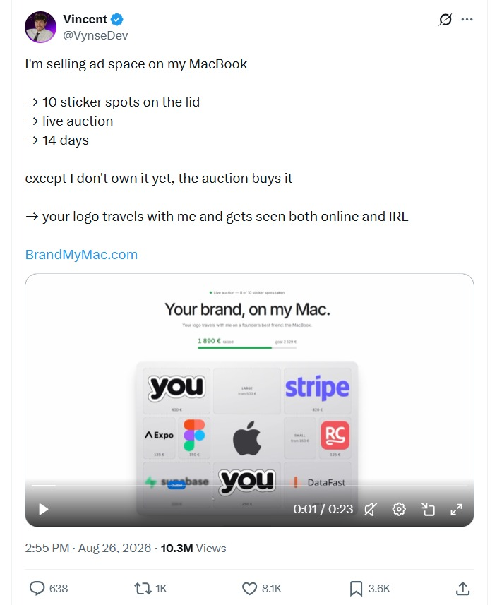
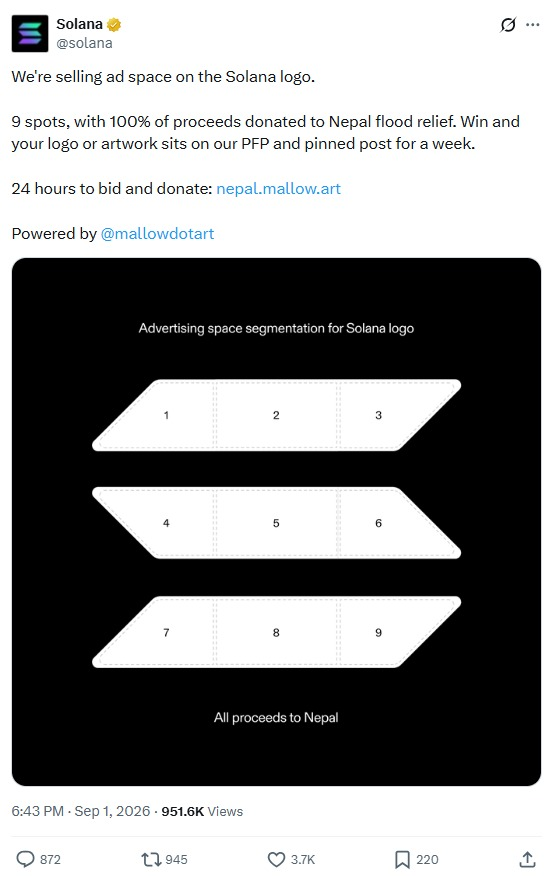

# brandmystuff

### Rent, lease and tokenise the ad space on the things you own, settled on Sui, named on ENS, paid out on any chain using Curvegrid.

---

Your laptop lid gets looked at in cafés, lecture halls and airport lounges for hours every day. So does the back of your car at every red light, the helmet you ride with, the backpack on the metro and the window of your corner shop. All of that is advertising inventory, and until now nobody has had a sensible way to sell it.

**brandmystuff** turns any physical object into ad inventory that is rentable, verifiable and tokenisable. You photograph an object and mark the ad spaces on it. An AI judge gives every space a transparent quality score. Brands, and autonomous AI agents, lease those spaces with USDC held in escrow on **Sui**, and the escrow is released only when the owner proves the ad is actually on display. An owner can then **tokenise** a space and sell fractional rights to its future lease income to verified investors, the same way real estate is tokenised, only the property is a laptop lid. Investors receive their share on Sui or, through **Curvegrid MultiBaas** and Circle CCTP, as native USDC on Ethereum, Base, Arbitrum or Optimism. Every account, object, space and lease also gets its own **ENSv2** name, whose records mirror the on-chain truth for anyone, human or agent, to read.

This README covers everything that has been built: the product, the architecture, and each integration in depth. It links directly to the code instead of pasting it.

---

## Important links

| What | Link |
|---|---|
| Submission URL | _To be added_ |
| Live App URL | _To be added_ (the app runs locally on `http://localhost:3010`) |
| Source code | [github.com/Marshal-AM/brandmystuff](https://github.com/Marshal-AM/brandmystuff) |
| Pitch deck | `/pitch` in the app ([source](https://github.com/Marshal-AM/brandmystuff/blob/main/web/src/app/pitch/page.tsx)) |
| Product docs | [docs/](https://github.com/Marshal-AM/brandmystuff/tree/main/docs) |
| Sui deployment manifest | [deployments/sui.testnet.json](https://github.com/Marshal-AM/brandmystuff/blob/main/deployments/sui.testnet.json) |
| ENS deployment manifest | [deployments/ens.sepolia.json](https://github.com/Marshal-AM/brandmystuff/blob/main/deployments/ens.sepolia.json) |
| Payout relayer manifest | [web/src/lib/payout-deployments.json](https://github.com/Marshal-AM/brandmystuff/blob/main/web/src/lib/payout-deployments.json) |

### Deployed smart contracts

Every contract and shared object the application talks to, grouped by chain.

#### Sui testnet: brandmystuff protocol

| Contract / object | Address | Role |
|---|---|---|
| `brandmystuff` package, v1 (original id) | [`0x926603f1…6d201b`](https://suiscan.xyz/testnet/object/0x926603f13f1a32f95057f50203dddb01bc24f1f799005cc40486fdf6969d201b) | Defines every type and event: admin, profile, kyc, asset, lease, offering, market, sponsor |
| `brandmystuff` package, v2 | [`0x82cf2dff…132a46`](https://suiscan.xyz/testnet/object/0x82cf2dff74c32618ca6cfeb8223b710933dce573514011e30ffe84bda9132a46) | Upgrade: expiring listings, buy orders (bids), restricted unit transfers |
| `brandmystuff` package, v3 (latest call target) | [`0x3d0cbbd8…fde7a4`](https://suiscan.xyz/testnet/object/0x3d0cbbd8dca61942c379cbab1b3770faad6578bb9194d90015c232557afde7a4) | Upgrade: the `payout` module for cross-chain payout routes |
| `brandmystuff_mandate` package | [`0x04edf0fa…9f7572`](https://suiscan.xyz/testnet/object/0x04edf0fa352278e44954e97c557844d3dcb76ab0ff13be1c1eb0f601219f7572) | On-chain budget mandates for brand AI agents |
| `Config` (shared) | [`0x9486d765…5c4082`](https://suiscan.xyz/testnet/object/0x9486d765ff202d4531a02f19b133ca198b989b61c9ac5193f3f654e48b5c4082) | Treasury, fees, sponsorship prices, week length, pause switch |
| `KycRegistry` (shared) | [`0xcf558523…ecb6202`](https://suiscan.xyz/testnet/object/0xcf5585232728b0688cc83a7b21a851db7e0377a9f5044348d6ad77eb7ecb6202) | ERC-3643-style investor identity registry |
| `PayoutRegistry` (shared) | [`0x203b2361…5c43bc`](https://suiscan.xyz/testnet/object/0x203b23613ab711f5e0cbca51e40fb43e7f234abf44bb607864aca2d6cd5c43bc) | Holder-signed cross-chain payout routes |
| `AdminCap` | [`0x3f7e222a…23ecaa`](https://suiscan.xyz/testnet/object/0x3f7e222ae88bd1715b1da113930905c66f63be0b9aeca3c00c32613d6a23ecaa) | Governance capability: fees, disputes, moderation |
| `OperatorCap` | [`0x4359cc41…45a5ffc`](https://suiscan.xyz/testnet/object/0x4359cc4198760c344e5e7b3530f279861469c4345d97799eda92b982845a5ffc) | Backend capability: AI scores, proof results, KYC records, x402 bookings, payouts |
| `UpgradeCap` | [`0x5e18b998…a6253e`](https://suiscan.xyz/testnet/object/0x5e18b998b6c1efff895ac1bee725d558338afce491bf227b4c8f071bf5a6253e) | Package upgrade authority |
| `Publisher` | [`0x5205d293…c98cc3b`](https://suiscan.xyz/testnet/object/0x5205d293cacdcf1be0b7219493cedbbbb9ff5a7a1bb04ce5a747b871cc98cc3b) | Package publisher object |
| Display: `AdSpace` | [`0xa4c8b5c1…aa5b65`](https://suiscan.xyz/testnet/object/0xa4c8b5c1a2e73adda32b673d063e3f1f24867b656bf70d4959d9eb2447aa5b65) | How ad spaces render in wallets and explorers |
| Display: `AdLease` | [`0xb3a59617…01fa57`](https://suiscan.xyz/testnet/object/0xb3a596174e94791c6b7aa16ae3e334ed85d0a182836df76bf9dd78e2ff01fa57) | How lease NFTs render |
| Display: `ListedObject` | [`0xf61535fd…fcb53f`](https://suiscan.xyz/testnet/object/0xf61535fd6fcdee7db04d561eb8fb692eb44cbb77ff68b0ad5ca3d14d02fcb53f) | How listed objects render |
| Platform / treasury address | [`0xc01af55e…c03848`](https://suiscan.xyz/testnet/account/0xc01af55e5dd68d924bd50e9c1556e07cd07cc1582e0f14cc0fdea17017c03848) | Treasury, operator signer, x402 `payTo` |

#### Sui testnet: third-party contracts we build on

| Contract / object | Address | Role |
|---|---|---|
| Circle USDC (Sui testnet) | [`0xa1ec7fc0…117e29::usdc::USDC`](https://suiscan.xyz/testnet/coin/0xa1ec7fc00a6f40db9693ad1415d0c193ad3906494428cf252621037bd7117e29::usdc::USDC) | The settlement asset for every payment |
| Circle CCTP TokenMessengerMinter | [`0x31cc14d8…6b8beb`](https://suiscan.xyz/testnet/object/0x31cc14d80c175ae39777c0238f20594c6d4869cfab199f40b69f3319956b8beb) | Burns USDC on Sui for a cross-chain mint |
| Circle CCTP MessageTransmitter | [`0x4931e06d…fdd0a5`](https://suiscan.xyz/testnet/object/0x4931e06dce648b3931f890035bd196920770e913e43e45990b383f6486fdd0a5) | Emits the attested CCTP message |
| CCTP TokenMessengerMinter state | [`0x5252abd1…82e7c2`](https://suiscan.xyz/testnet/object/0x5252abd1137094ed1db3e0d75bc36abcd287aee4bc310f8e047727ef5682e7c2) | Shared state object for burns |
| CCTP MessageTransmitter state | [`0x98234bd0…122d2e`](https://suiscan.xyz/testnet/object/0x98234bd0fa9ac12cc0a20a144a22e36d6a32f7e0a97baaeaf9c76cdc6d122d2e) | Shared state object for messages |
| USDC treasury | [`0x7170137d…629ebe`](https://suiscan.xyz/testnet/object/0x7170137d4a6431bf83351ac025baf462909bffe2877d87716374fb42b9629ebe) | Circle's USDC treasury on Sui |

#### Ethereum Sepolia: ENSv2

| Contract | Address | Role |
|---|---|---|
| brandmystuff platform resolver (PermissionedResolver proxy) | [`0x74F61f74Dce90068f35d1B3D4f7b4a3886BDE54c`](https://sepolia.etherscan.io/address/0x74F61f74Dce90068f35d1B3D4f7b4a3886BDE54c) | Holds every record for every brandmystuff name |
| brandmystuff root registry (UserRegistry proxy) | [`0xeF15c35f03215bAdE4A054F034382534D8f1f30f`](https://sepolia.etherscan.io/address/0xeF15c35f03215bAdE4A054F034382534D8f1f30f) | Subregistry for the children of `brandmystuff.eth` |
| ENSv2 RootRegistry | [`0x9703dbd26dab89504490994138cf2c575251a9ce`](https://sepolia.etherscan.io/address/0x9703dbd26dab89504490994138cf2c575251a9ce) | ENSv2 root |
| ENSv2 ETHRegistry | [`0x657ea849311d3d5823348dded7c2aaafb3ede09e`](https://sepolia.etherscan.io/address/0x657ea849311d3d5823348dded7c2aaafb3ede09e) | `.eth` registry, where `brandmystuff.eth` lives |
| ENSv2 ETHRegistrar | [`0xabe76f6c8dfced81aa5a2bb8034202a7136b94ca`](https://sepolia.etherscan.io/address/0xabe76f6c8dfced81aa5a2bb8034202a7136b94ca) | Commit/reveal registration of `brandmystuff.eth` |
| ENSv2 VerifiableFactory | [`0x9e726eb570beb6bceb495ab8cda7df517d4e841c`](https://sepolia.etherscan.io/address/0x9e726eb570beb6bceb495ab8cda7df517d4e841c) | Deploys our registry and resolver proxies |
| PermissionedResolver implementation | [`0x14f09fd05d4585759e54844dc9b00147131cf243`](https://sepolia.etherscan.io/address/0x14f09fd05d4585759e54844dc9b00147131cf243) | Logic behind the platform resolver |
| UserRegistry implementation | [`0xa80338aaa8d23831cea25e858d1774534abb0263`](https://sepolia.etherscan.io/address/0xa80338aaa8d23831cea25e858d1774534abb0263) | Logic behind every per-parent subregistry |
| UniversalResolver | [`0xeEeEEEeE14D718C2B47D9923Deab1335E144EeEe`](https://sepolia.etherscan.io/address/0xeEeEEEeE14D718C2B47D9923Deab1335E144EeEe) | Every live ENS read in the app |

#### EVM testnets: cross-chain payout relayer (deployed through Curvegrid MultiBaas)

| Chain | BrandMyStuffPayoutRelayer | Circle MessageTransmitter (CCTP V1) | Circle USDC |
|---|---|---|---|
| Ethereum Sepolia | [`0xde0Ef453B6233549CbfcDe781838FAd7761A710C`](https://sepolia.etherscan.io/address/0xde0Ef453B6233549CbfcDe781838FAd7761A710C) | [`0x7865fAfC…086BEFD`](https://sepolia.etherscan.io/address/0x7865fAfC2db2093669d92c0F33AeEF291086BEFD) | [`0x1c7D4B19…79C7238`](https://sepolia.etherscan.io/address/0x1c7D4B196Cb0C7B01d743Fbc6116a902379C7238) |
| Base Sepolia | [`0x436e6DbF5C73f416ce5D0D74495794647ab85118`](https://sepolia.basescan.org/address/0x436e6DbF5C73f416ce5D0D74495794647ab85118) | [`0x7865fAfC…086BEFD`](https://sepolia.basescan.org/address/0x7865fAfC2db2093669d92c0F33AeEF291086BEFD) | [`0x036CbD53…f3dCF7e`](https://sepolia.basescan.org/address/0x036CbD53842c5426634e7929541eC2318f3dCF7e) |
| Arbitrum Sepolia | [`0x5273087816B636ab98455F9892A551E5E2935289`](https://sepolia.arbiscan.io/address/0x5273087816B636ab98455F9892A551E5E2935289) | [`0xaCF1ceeF…41B4872`](https://sepolia.arbiscan.io/address/0xaCF1ceeF35caAc005e15888dDb8A3515C41B4872) | [`0x75faf114…E46AA4d`](https://sepolia.arbiscan.io/address/0x75faf114eafb1BDbe2F0316DF893fd58CE46AA4d) |
| Optimism Sepolia | [`0x2AA2a1264a5a19f7d14Bf8a806f1fdaa12F3E226`](https://sepolia-optimism.etherscan.io/address/0x2AA2a1264a5a19f7d14Bf8a806f1fdaa12F3E226) | [`0x7865fAfC…086BEFD`](https://sepolia-optimism.etherscan.io/address/0x7865fAfC2db2093669d92c0F33AeEF291086BEFD) | [`0x5fd84259…43130D7`](https://sepolia-optimism.etherscan.io/address/0x5fd84259d66Cd46123540766Be93DFE6D43130D7) |

The platform EVM key [`0x2514844F312c02Ae3C9d4fEb40db4eC8830b6844`](https://sepolia.etherscan.io/address/0x2514844F312c02Ae3C9d4fEb40db4eC8830b6844) owns the ENS names it relays for, owns every relayer and is the relayer's only authorised caller.

### Important transactions

The chain events that took the protocol from nothing to a working marketplace, and a sample of real app traffic.

#### Deployment and upgrades

| Event | Chain | Transaction |
|---|---|---|
| `brandmystuff` package published (v1) | Sui testnet | [`5s1g8GBWpuqYU2zkm7QVM5aViD94G93a16H7sdhMwrUC`](https://suiscan.xyz/testnet/tx/5s1g8GBWpuqYU2zkm7QVM5aViD94G93a16H7sdhMwrUC) |
| Package upgraded to v2 (bids, expiring asks, unit transfers) | Sui testnet | [`Cc83TfMRuKjLNecnVTotyDSSTQByjWGsZ4QUJqKgaPRr`](https://suiscan.xyz/testnet/tx/Cc83TfMRuKjLNecnVTotyDSSTQByjWGsZ4QUJqKgaPRr) |
| Package upgraded to v3 (cross-chain payouts) | Sui testnet | [`8SVTbYCKgcZTgdB4Eo9ZwtE3xCwMnFSX4kFX5szP3FW4`](https://suiscan.xyz/testnet/tx/8SVTbYCKgcZTgdB4Eo9ZwtE3xCwMnFSX4kFX5szP3FW4) |
| `PayoutRegistry` created with domains 0, 2, 3, 6 | Sui testnet | [`Bj4bddH8JZmS3DNuqQwLCa5gAg5JLXVAs6M7SCTxigVm`](https://suiscan.xyz/testnet/tx/Bj4bddH8JZmS3DNuqQwLCa5gAg5JLXVAs6M7SCTxigVm) |
| `brandmystuff_mandate` package published | Sui testnet | [`FjmmhghkW1U7oz81auWCKWdrBtb6KEwrMwCfdj6GfCkN`](https://suiscan.xyz/testnet/tx/FjmmhghkW1U7oz81auWCKWdrBtb6KEwrMwCfdj6GfCkN) |
| Display objects configured | Sui testnet | [`Hk3QFz5eqKZWNWMCGHkWQR9a6uo9VZxqK1DT3fX1cF7j`](https://suiscan.xyz/testnet/tx/Hk3QFz5eqKZWNWMCGHkWQR9a6uo9VZxqK1DT3fX1cF7j) |
| Payout relayer deployed via MultiBaas | Ethereum Sepolia | [`0xe7cce738…859d4d5`](https://sepolia.etherscan.io/tx/0xe7cce738c3d2ccfc15d251eab7898527bdbc0e53eeafa824ec695d219859d4d5) |
| Payout relayer deployed via MultiBaas | Base Sepolia | [`0xf7828e27…9e7f7d`](https://sepolia.basescan.org/tx/0xf7828e27ef1c43f0e8e24384adfcf9470807f1164ea1f747da65ff62649e7f7d) |
| Payout relayer deployed via MultiBaas | Arbitrum Sepolia | [`0xda9612c9…ab44c0b`](https://sepolia.arbiscan.io/tx/0xda9612c9ba430e44369fd03e11e2f3a5ac0d16949f1decefa5bccb6eabb44c0b) |
| Payout relayer deployed via MultiBaas | Optimism Sepolia | [`0x3668433a…1f3b08`](https://sepolia-optimism.etherscan.io/tx/0x3668433ac52c53b408831065cabc6333c335eb28addbf8f651651f31691f3b08) |

#### The marketplace in motion (Sui testnet)

| Moment | Event emitted | Transaction |
|---|---|---|
| A user creates an on-chain profile | `profile::ProfileCreated` | [`DSqZK7gJ…PBtPTXTaKMTL7DYUuMmg2ghUMuB7TEbPD`](https://suiscan.xyz/testnet/tx/DSqZK7gJ2wJPBtPTXTaKMTL7DYUuMmg2ghUMuB7TEbPD) |
| A physical object is listed | `asset::ObjectCreated` | [`3SF86XFT…Dee7aYQ258b6Pp1JjVPvPp6t`](https://suiscan.xyz/testnet/tx/3SF86XFTzBw7GHTLLc34Dee7aYQ258b6Pp1JjVPvPp6t) |
| An ad space is added to it | `asset::SpaceAdded` | [`8EWP9zWR…zWB6LRXhDXppSviGxjq6JvHEfAZ`](https://suiscan.xyz/testnet/tx/8EWP9zWR5k7Wa5WzpBjB6LRXhDXppSviGxjq6JvHEfAZ) |
| The AI score is written on-chain | `asset::SpaceScored` | [`Hi9gnQ3y…4jLqgpgCvsTavtzaYi1RrNiTPJAD4HkJ`](https://suiscan.xyz/testnet/tx/Hi9gnQ3ybW6Z4jLqgpgCvsTavtzaYi1RrNiTPJAD4HkJ) |
| A brand books the space into escrow | `lease::LeaseBooked` | [`BAEdmZdF…6u3ev741xDTnwJRqMiAoyAeXxypf3cvbq`](https://suiscan.xyz/testnet/tx/BAEdmZdFps62u3ev741xDTnwJRqMiAoyAeXxypf3cvbq) |
| The owner approves the creative | `lease::CreativeApproved` | [`YoyDpXEN…9gou9CAZPh1Qb9`](https://suiscan.xyz/testnet/tx/YoyDpXENCL3fjbAznKRE6EEL2J7Jwgcou9CAZPh1Qb9) |
| An AI-verified proof releases a tranche | `lease::ProofAccepted` | [`9Dug3Xq1…Q5NHzvLP7Mfee9u1Dct6ooNy`](https://suiscan.xyz/testnet/tx/9Dug3Xq1VMNTUCMHtMH5q5NHzvLP7Mfee9u1Dct6ooNy) |
| A tranche is split and paid, with the investor share distributed | `lease::TrancheReleased` + `offering::Distributed` | [`DeL7d7sZ…Pw5PPscKTNPeTdUWuYJHH3f5PU2jbvaR`](https://suiscan.xyz/testnet/tx/DeL7d7sZ64pnGw5PPscKTNPeTdUWuYJHH3f5PU2jbvaR) |
| A lease runs to completion | `lease::LeaseCompleted` | [`8qkUXi1t…WV9XZ4YHsLPz5JqVWgPeQbRyuU`](https://suiscan.xyz/testnet/tx/8qkUXi1tDogNHy5nxVWV9XZ4YHsLPz5JqVWgPeQbRyuU) |
| A dispute is opened | `lease::DisputeOpened` | [`G96PdeEj…CEm1ZjUYNsCb`](https://suiscan.xyz/testnet/tx/G96PdeEj7uiztMBaGypAyqCT9aUYiF46cEm1ZjUYNsCb) |
| An investor passes identity verification | `kyc::InvestorVerified` | [`tzTG5owL…QMG9EEbz9N1Q`](https://suiscan.xyz/testnet/tx/tzTG5owLm29i5chcAPhcVEx5b5siuxAQMG9EEbz9N1Q) |
| A space is tokenised | `offering::OfferingOpened` | [`AtwZYn58…obMaSU9tqr9267eiQD2E1CFm`](https://suiscan.xyz/testnet/tx/AtwZYn58dTDVqhBHQwzdobMaSU9tqr9267eiQD2E1CFm) |
| Investors buy revenue units | `offering::UnitsPurchased` | [`Dof5BGrR…y64sJPi8GE1GrcngoRJ67G8kgJfdqF`](https://suiscan.xyz/testnet/tx/Dof5BGrRa5hwg8y64sJPi8GE1GrcngoRJ67G8kgJfdqF) |
| The offering closes successfully | `offering::OfferingClosed` | [`84AKGqcq…3Vty8wrnFRXxfdpS5NLHCznBdNWhHYeJ`](https://suiscan.xyz/testnet/tx/84AKGqcqpgiR3Vty8wrnFRXxfdpS5NLHCznBdNWhHYeJ) |
| A holder claims income | `offering::Claimed` | [`2nRt5zsU…XYiAm7XWuKtrNNN5HQePubsJ5S34BYpqL`](https://suiscan.xyz/testnet/tx/2nRt5zsUnnGXYiAm7XWuKtrNNN5HQePubsJ5S34BYpqL) |
| Revenue units change hands on the secondary market | `market::Trade` | [`4ZvYApu2…JxRjkP2UYj4SgTYiyzEUQTvUzcRW6t3vXtLt`](https://suiscan.xyz/testnet/tx/4ZvYApu2FxRjkP2UYj4SgTYiyzEUQTvUzcRW6t3vXtLt) |
| An object is sponsored | `sponsor::Sponsored` | [`5EZ4Y5NX…m3MBoVBbckb8JPCEChZrWxH46hQQW5eRu`](https://suiscan.xyz/testnet/tx/5EZ4Y5NXszhm3MBoVBbckb8JPCEChZrWxH46hQQW5eRu) |
| An AI agent pays for a lease over x402 | x402 payment | [`D4wm2vg4…6xfNuf5LQ8zJcBgr98YjfmyzbPnQGScdz`](https://suiscan.xyz/testnet/tx/D4wm2vg48jxB6fNuf5LQ8zJcBgr98YjfmyzbPnQGScdz) |

#### ENS writes on Sepolia, relayed from Sui events

| Name | Action | Transaction |
|---|---|---|
| `sam.brandmystuff.eth` (account) | register | [`0x99121e9b…35dbf9dd`](https://sepolia.etherscan.io/tx/0x99121e9b820812e3a73800f351e0d4a4869847643b74803cd2b852e235dbf9dd) |
| `macbook-pro-14.sam.brandmystuff.eth` (object) | register | [`0xdf325a5a…273e65`](https://sepolia.etherscan.io/tx/0xdf325a5ab0f2d9b7db6fa984b25c23bf9605f8f730251352b489b00523273e65) |
| `lid-center.macbook-pro-14.sam.brandmystuff.eth` (space) | register | [`0xc28bd6a3…746eaf42`](https://sepolia.etherscan.io/tx/0xc28bd6a30c6defe41c38a14651e2f78c6c49e51ead9e2df7ba5dac28746eaf42) |
| `apple.brandmystuff.eth` (brand account) | register | [`0xf59a4ec9…dbb09721`](https://sepolia.etherscan.io/tx/0xf59a4ec9c7d7e9abf3eceb9f9fd587ff38160c319c800b084e17e452dbb09721) |
| `l-19.macbook-lid.test.samfelix.brandmystuff.eth` (lease) | reserve | [`0x750bbb0d…b8dc357d0b`](https://sepolia.etherscan.io/tx/0x750bbb0d5c110c4f652b0bd063e96a68340e809c0771afdd00fb37b8dc357d0b) |
| `l-19.macbook-lid.test.samfelix.brandmystuff.eth` (lease) | register | [`0x547b86c4…5309fde6`](https://sepolia.etherscan.io/tx/0x547b86c4e1e49a1aaaaf0076298bc6c9261cfe17f908980ef82367f2cfc40feb) |
| `l-19.macbook-lid.test.samfelix.brandmystuff.eth` (lease) | records | [`0xe871a3b0…cb4bcb`](https://sepolia.etherscan.io/tx/0xe871a3b0473fa20ee6004bd01231259a1913fda19cd4e60885fc093e67cb4bcb) |

#### Cross-chain

| Moment | Chain | Transaction |
|---|---|---|
| USDC burned on Sui, attested by Circle, then minted as native USDC on Base Sepolia (the CCTP path end to end) | Base Sepolia | [`0x8d6dd88d…e561979b5`](https://sepolia.basescan.org/tx/0x8d6dd88d02939c10a44136564fd938810b4f27e443d3532ae25b0e9e561979b5) |

---

## Table of contents

1. [Introduction](#1-introduction)
2. [The problem](#2-the-problem)
   - [2.1 The trend that proved the demand](#21-the-trend-that-proved-the-demand)
   - [2.2 Real-world advertising is priced for giants](#22-real-world-advertising-is-priced-for-giants)
   - [2.3 Then trust broke the cheaper option](#23-then-trust-broke-the-cheaper-option)
   - [2.4 What is actually broken](#24-what-is-actually-broken)
   - [2.5 Who feels it](#25-who-feels-it)
3. [The solution](#3-the-solution)
   - [3.1 The economics in one table](#31-the-economics-in-one-table)
   - [3.2 How brandmystuff compares](#32-how-brandmystuff-compares)
   - [3.3 Why people buy a slice of a spot](#33-why-people-buy-a-slice-of-a-spot)
   - [3.4 The viral upside](#34-the-viral-upside)
   - [3.5 Go-to-market](#35-go-to-market)
4. [System architecture](#4-system-architecture)
   - [4.1 The big picture](#41-the-big-picture)
   - [4.2 Repository map](#42-repository-map)
   - [4.3 The web application](#43-the-web-application)
   - [4.4 Identity, wallets and signing](#44-identity-wallets-and-signing)
   - [4.5 The read model: indexer, jobs and scheduler](#45-the-read-model-indexer-jobs-and-scheduler)
   - [4.6 Storage on Walrus](#46-storage-on-walrus)
   - [4.7 The AI judge: Ad-Space Quality Score](#47-the-ai-judge-ad-space-quality-score)
   - [4.8 Proof of display](#48-proof-of-display)
   - [4.9 Tokenisation, legal pack and KYC](#49-tokenisation-legal-pack-and-kyc)
   - [4.10 Agentic commerce (summary)](#410-agentic-commerce-summary)
   - [4.11 Communication: chat, notifications, activity](#411-communication-chat-notifications-activity)
   - [4.12 End-to-end journeys](#412-end-to-end-journeys)
   - [4.13 Testing](#413-testing)
   - [4.14 Running it locally](#414-running-it-locally)
   - [4.15 Demo mode and the pitch deck](#415-demo-mode-and-the-pitch-deck)
5. [Sui](#5-sui)
   - [5.1 Why Sui](#51-why-sui)
   - [5.2 What runs on Sui](#52-what-runs-on-sui)
   - [5.3 The contracts](#53-the-contracts)
   - [5.4 Upgrades and versioning](#54-upgrades-and-versioning)
   - [5.5 Talking to Sui from the app](#55-talking-to-sui-from-the-app)
   - [5.6 x402 on Sui](#56-x402-on-sui)
   - [5.7 Walrus and Display](#57-walrus-and-display)
   - [5.8 Security model and invariants](#58-security-model-and-invariants)
6. [Curvegrid MultiBaas](#6-curvegrid-multibaas)
   - [6.1 Why cross-chain payouts](#61-why-cross-chain-payouts)
   - [6.2 Design principles](#62-design-principles)
   - [6.3 The payout relayer contract](#63-the-payout-relayer-contract)
   - [6.4 MultiBaas as the EVM backbone](#64-multibaas-as-the-evm-backbone)
   - [6.5 The payout pipeline, step by step](#65-the-payout-pipeline-step-by-step)
   - [6.6 Webhooks, event indexing and event queries](#66-webhooks-event-indexing-and-event-queries)
   - [6.7 The user experience](#67-the-user-experience)
   - [6.8 Setup, operations and safety](#68-setup-operations-and-safety)
   - [6.9 Failure handling](#69-failure-handling)
7. [ENS](#7-ens)
   - [7.1 Why ENS](#71-why-ens)
   - [7.2 Bootstrapping brandmystuff.eth on ENSv2](#72-bootstrapping-brandmystuffeth-on-ensv2)
   - [7.3 The naming tree](#73-the-naming-tree)
   - [7.4 Records: the public face of on-chain state](#74-records-the-public-face-of-on-chain-state)
   - [7.5 Enhanced Access Control: split write rights](#75-enhanced-access-control-split-write-rights)
   - [7.6 Leases: expiring names the advertiser holds](#76-leases-expiring-names-the-advertiser-holds)
   - [7.7 Brand agents as namespaces](#77-brand-agents-as-namespaces)
   - [7.8 The Sui-to-ENS relayer](#78-the-sui-to-ens-relayer)
   - [7.9 Reading, verifying and proving permissions](#79-reading-verifying-and-proving-permissions)
   - [7.10 ENS for outside agents](#710-ens-for-outside-agents)
   - [7.11 ENS in the interface](#711-ens-in-the-interface)
   - [7.12 A name's life, end to end](#712-a-names-life-end-to-end)
8. [Agents](#8-agents)
   - [8.1 The agents at a glance](#81-the-agents-at-a-glance)
   - [8.2 Scout, the brand's ad-buying agent](#82-scout-the-brands-ad-buying-agent)
   - [8.3 Scout's on-chain leash: the budget mandate](#83-scouts-on-chain-leash-the-budget-mandate)
   - [8.4 Scout's ENS identity, permissions and receipts](#84-scouts-ens-identity-permissions-and-receipts)
   - [8.5 External AI agents: MCP, x402 and ENS discovery](#85-external-ai-agents-mcp-x402-and-ens-discovery)
   - [8.6 The AI judges](#86-the-ai-judges)
   - [8.7 The platform's autonomous operators](#87-the-platforms-autonomous-operators)
   - [8.8 Guardrails that apply to every agent](#88-guardrails-that-apply-to-every-agent)
9. [Roadmap](#9-roadmap)
10. [Conclusion](#10-conclusion)

---

## 1. Introduction

brandmystuff is a marketplace for **physical ad space on everyday objects**, built as a working testnet product rather than a pitch deck. Every flow described here runs against real infrastructure:

- Sui testnet for money, rules and ownership,
- Ethereum Sepolia for names,
- four EVM testnets for payouts,
- Walrus for media and documents,
- Gemini for vision,
- Supabase for the fast read model.

There are no mock contracts. There is no fake chain.

The product serves five kinds of participant:

| Participant | What they do on brandmystuff |
|---|---|
| **Owner** | Lists objects (a laptop, car, helmet, backpack, storefront or wall), marks ad spaces, sets weekly prices, approves creatives, proves display, earns USDC |
| **Advertiser / brand** | Discovers ranked spaces, books weeks with escrowed USDC, ships creatives from a brand kit, watches proofs arrive |
| **AI agent** | Discovers inventory through ENS and MCP, pays over HTTP 402, and books leases with no human in the loop |
| **Investor** | Passes identity checks, buys revenue units of tokenised spaces, earns a pro-rata share of every tranche, trades units, and chooses which chain to be paid on |
| **Platform ops** | Holds the admin and operator capabilities, moderates, resolves disputes, runs the worker |

Four ideas carry the whole product:

1. **Trust is programmable.** The escrow, the release conditions, the fee waterfall and the investor ledger are Move code on Sui, not promises in a terms-of-service page.
2. **Quality is measurable.** Every space carries an explainable score, the Ad-Space Quality Score (AQS), built from deterministic image metrics plus sampled, rubric-anchored AI judgements.
3. **Everything has a name.** Every user, object, space and lease is an ENSv2 subname whose records mirror the chain, so the inventory is legible to any ENS-aware tool or agent.
4. **Money goes where people are.** Revenue is earned on Sui, and holders can choose to receive it as native USDC on the EVM chain they already use, with every EVM step orchestrated through Curvegrid MultiBaas.

---

## 2. The problem

### 2.1 The trend that proved the demand

In 2025–2026 people started selling ad space on their own things, and the internet loved it. Three posts show the pattern:

<table>
<tr>
<td width="33%"></td>
<td width="33%"></td>
<td width="33%"></td>
</tr>
<tr>
<td><b>10.3M views</b> A developer's MacBook: 10 sticker spots auctioned in 14 days</td>
<td><b>951.6K views</b> Solana's own logo: 9 ad spots on the brand's profile picture</td>
<td><b>448.5K views</b> A groom's tuxedo: sponsors paid for the wedding suit</td>
</tr>
</table>

The MacBook auction, documented in [docs/IDEA-AND-FLOWS.md](https://github.com/Marshal-AM/brandmystuff/blob/main/docs/IDEA-AND-FLOWS.md), is the clearest case:

| Signal | Number |
|---|---|
| Views on the launch post | 10.38 M |
| Spots sold | 20 of 20 |
| Raised | €7,955, 315% of the €2,529 goal |
| Bids | 150, from 64 brands |
| Top spot | €1,715 |

These posts went viral for one reason: **small and mid-size brands finally saw real-world advertising they could afford.**

- **Affordable.** A spot cost a few hundred euros, not the tens of thousands a billboard campaign costs.
- **It travels.** The ad goes wherever the person goes: cafés, campuses, flights, conferences, even a wedding.
- **It's human.** A real person carrying your brand feels like a recommendation, not an interruption.

The buyers weren't global giants. They were startups, indie tools and small brands putting their name into the physical world for the first time.

### 2.2 Real-world advertising is priced for giants

Most brands in the world are small or mid-size. They can afford to be seen online, but the physical world, where people actually spend their day, is priced for large advertisers:

| Barrier | What it means for a small brand |
|---|---|
| **Too expensive** | Billboards, transit and venue ads are sold in big blocks, often thousands a month, with long minimum terms. |
| **Built for big budgets** | Media agencies and ad networks want large clients. A $500 brand isn't worth their time. |
| **Stuck in one place** | A billboard reaches whoever passes one corner. A small brand can't afford to be on every corner. |
| **Hard to judge** | There is no simple way to know whether a placement is any good before paying for it. |

Everyday objects fix the first three problems at once: they are cheap, they move, and they are carried by real people. What was missing was a way to buy them safely.

### 2.3 Then trust broke the cheaper option

The viral auctions proved demand, then showed exactly why nobody could build a business on it:

- **6 of 20 MacBook winners never paid.** The model was a 20% deposit followed by an invoice, and nothing enforced the rest.
- **No quality signal.** Brands had no way to compare one spot with another.
- **No proof.** Nobody could show the sticker actually went up, week after week.
- **No discovery.** The laptop-only marketplace that followed shows **1,632 free spots against 32 taken**, with a median of 14 page views for small sellers.

Vehicle-wrap incumbents such as Carvertise and Wrapify prove the business works when display can be verified, but they are closed, vertical and slow.

### 2.4 What is actually broken

| Gap | Why it hurts |
|---|---|
| **Real-world ads priced out of reach** | Small and mid-size brands can't buy billboards, transit or venue ads at their budgets. |
| **No enforceable payment** | Deposit-then-invoice invites defaults. Owners install a sticker and are never paid. |
| **No quality signal** | A laptop lid seen by 400 people a day and one kept in a drawer are listed identically, so brands can't rank and don't buy. |
| **No proof of display** | Brands pay and hope. Owners have no standard way to prove the ad is up, week after week. |
| **Narrow, siloed supply** | One site per object type, tiny audiences, no shared discovery. |
| **No way to capitalise income** | An owner with a strong space earns only week by week and cannot raise against future income. |
| **No machine buyers** | AI marketing agents with budgets can't find, evaluate or pay for this inventory programmatically. |
| **Payouts locked to one chain** | An investor who lives on Base or Arbitrum shouldn't have to bridge manually to collect a few dollars of ad income. |

### 2.5 Who feels it

The product docs ([docs/PRD.md](https://github.com/Marshal-AM/brandmystuff/blob/main/docs/PRD.md)) are written around real personas:

- **Maya**, a student creator whose MacBook, helmet and backpack are seen by thousands every week.
- **Raj**, a rideshare driver whose car is on the road eight hours a day.
- **Lena**, a shop owner with a storefront window facing a busy street.
- **Theo**, an indie SaaS founder with a $300–3,000 budget who wants authentic, local placements.
- A **growth agent**: an AI with a USDC wallet and a mandate to find attention cheaply.
- **Kenji**, an investor who wants yield from real-world ad income.

---

## 3. The solution

brandmystuff answers each gap with a specific mechanism, and each mechanism lives where it is most trustworthy.

| Gap | brandmystuff mechanism | Where it lives |
|---|---|---|
| Defaults | The **full lease amount is paid upfront into an escrow object** and released in tranches | [`lease.move`](https://github.com/Marshal-AM/brandmystuff/blob/main/move/brandmystuff/sources/lease.move) on Sui |
| No quality signal | **AQS**: deterministic image metrics plus N-sample rubric judgements, aggregated in code and written on-chain | [`scoring/pipeline.ts`](https://github.com/Marshal-AM/brandmystuff/blob/main/web/src/server/scoring/pipeline.ts) → [`asset::apply_score`](https://github.com/Marshal-AM/brandmystuff/blob/main/move/brandmystuff/sources/asset.move#L306) |
| No proof | **Periodic proof-of-display photos**, AI-checked against the listing and the approved creative, each one releasing a tranche | [`proofs.ts`](https://github.com/Marshal-AM/brandmystuff/blob/main/web/src/server/proofs.ts#L44) → [`lease::accept_proof`](https://github.com/Marshal-AM/brandmystuff/blob/main/move/brandmystuff/sources/lease.move#L340) |
| Narrow supply | **Any object**, free-form, with an AI-derived profile (exposure class, viewer mode, viewing distance) | [`api/objects/check`](https://github.com/Marshal-AM/brandmystuff/blob/main/web/src/app/api/objects/check/route.ts) |
| No capital | **Tokenisation**: 10,000 revenue units per space, sold to KYC-verified investors, with a pull-based revenue accumulator | [`offering.move`](https://github.com/Marshal-AM/brandmystuff/blob/main/move/brandmystuff/sources/offering.move) |
| No machine buyers | **x402 over Sui**, an **MCP server**, **ENSIP-26 agent records** and **Scout**, a brand agent bound by an on-chain budget mandate | [`x402.ts`](https://github.com/Marshal-AM/brandmystuff/blob/main/web/src/server/x402.ts), [`mandate.move`](https://github.com/Marshal-AM/brandmystuff/blob/main/move/mandate/sources/mandate.move) |
| Single-chain payouts | **Holder-signed payout routes on Sui**, Circle CCTP burns, and a relayer driven through **Curvegrid MultiBaas** | [`payout.move`](https://github.com/Marshal-AM/brandmystuff/blob/main/move/brandmystuff/sources/payout.move), [`server/payouts`](https://github.com/Marshal-AM/brandmystuff/tree/main/web/src/server/payouts) |
| Opaque listings | **ENSv2 names with rich records** for every entity, verified two-way against Sui | [`server/ens`](https://github.com/Marshal-AM/brandmystuff/tree/main/web/src/server/ens) |

### 3.1 The economics in one table

All of these numbers are enforced on-chain and set in [`admin.move`](https://github.com/Marshal-AM/brandmystuff/blob/main/move/brandmystuff/sources/admin.move#L52-L71).

| Parameter | Value | Enforced by |
|---|---|---|
| Platform fee on every lease tranche | 12% (1,200 bps), capped at 30% | [`admin::set_fees`](https://github.com/Marshal-AM/brandmystuff/blob/main/move/brandmystuff/sources/admin.move#L85) |
| Owner net on a non-tokenised space | 88% | [`lease::accept_proof`](https://github.com/Marshal-AM/brandmystuff/blob/main/move/brandmystuff/sources/lease.move#L340) |
| Origination fee on a successful raise | 3% | [`offering::close`](https://github.com/Marshal-AM/brandmystuff/blob/main/move/brandmystuff/sources/offering.move#L281) |
| Secondary market fee | 1% | [`market::fill`](https://github.com/Marshal-AM/brandmystuff/blob/main/move/brandmystuff/sources/market.move#L52) |
| Sponsorship | tier 1: 3 USDC/day, tier 2: 10 USDC/day | [`sponsor.move`](https://github.com/Marshal-AM/brandmystuff/blob/main/move/brandmystuff/sources/sponsor.move#L57-L73) |
| Revenue units per tokenised space | 10,000 | [`offering.move`](https://github.com/Marshal-AM/brandmystuff/blob/main/move/brandmystuff/sources/offering.move#L16) |
| Revenue share sold to investors | 10%–88% of each tranche | [`offering::create`](https://github.com/Marshal-AM/brandmystuff/blob/main/move/brandmystuff/sources/offering.move#L150) |
| Proof match threshold | 80% creative match and 80% object match | [`lease.move`](https://github.com/Marshal-AM/brandmystuff/blob/main/move/brandmystuff/sources/lease.move#L28) |

On testnet a lease "week" lasts **10 minutes** (`weekMs = 600000` in [deployment.ts](https://github.com/Marshal-AM/brandmystuff/blob/main/web/src/lib/deployment.ts)), so a full lease lifecycle (booking, approval, install proof, weekly proofs, completion, investor distribution) plays out in well under an hour. Every time window in the contracts is expressed as a fraction of the week, so the same code runs unchanged at a real seven-day week.

### 3.2 How brandmystuff compares

| | One-off "brand my laptop" auctions | Laptop-only marketplaces | Vehicle-wrap platforms | **brandmystuff** |
|---|---|---|---|---|
| Object types | One laptop | Laptops | Cars | **Anything with a surface** |
| Payment guarantee | 20% deposit, then an invoice | Platform-held | Platform contract | **Full amount in on-chain escrow** |
| Quality signal | None | None | Internal | **Public AQS with a report on Walrus** |
| Proof of display | Screenshots, goodwill | Optional | Install and monthly photos | **AI-verified photos gate every tranche** |
| Refunds on failure | Manual | Manual | Manual | **Callable by anyone once a deadline passes** |
| Capital for owners | No | No | No | **Tokenised revenue units** |
| AI agent buyers | No | No | No | **x402, MCP, ENSIP-26, mandates** |
| Public, portable identity | No | No | No | **ENSv2 names with verified records** |
| Where investors get paid | n/a | n/a | n/a | **Sui, Ethereum, Base, Arbitrum or Optimism** |

Every "manual" in the first three columns is a trust assumption. brandmystuff replaces each one with a rule that runs on a public chain.

### 3.3 Why people buy a slice of a spot

Tokenisation splits one ad space into 10,000 revenue units. Owners get money upfront, and anyone who passes identity checks can own part of the spot's future ad income, like owning a tiny piece of a building that pays rent.

| Reason | What the holder gets |
|---|---|
| **Income from the real world** | Every time a brand rents the spot, a share of the rent is paid to holders. It is actual ad money, not a speculative price. |
| **A tiny entry ticket** | 10,000 units per spot, so a holder can start with pocket change. |
| **Visible performance** | Every week the owner posts a photo proving the ad is up, so holders can watch the asset earn. |
| **Paid where they are** | Income arrives on Sui or, through [Curvegrid MultiBaas](#6-curvegrid-multibaas), on Ethereum, Base, Arbitrum or Optimism. |
| **Liquidity** | Units trade on the [secondary market](#537-market-a-compliant-order-book) with other verified holders. |
| **Backing people early** | Own part of a creator's laptop, a driver's car or a café's window, and grow with them. |

A worked example: a laptop spot rents for $40 a week, and the owner sold a 60% revenue share. Holders receive $24 of every week's rent, so **a 1% holder earns $0.24 a week** while the spot is rented. The owner was already paid upfront for the units sold. The split is exactly what [`lease::accept_proof_tokenised`](https://github.com/Marshal-AM/brandmystuff/blob/main/move/brandmystuff/sources/lease.move#L364) and [`offering::distribute`](https://github.com/Marshal-AM/brandmystuff/blob/main/move/brandmystuff/sources/offering.move#L348-L361) do on-chain.

### 3.4 The viral upside

The trend itself shows why holding units early can pay off. A spot can go viral, the same way a token takes off after good marketing:

1. **Post it.** The owner shares their spot on X, TikTok or Instagram: "brand my laptop".
2. **It goes viral.** Attention snowballs, as it did for the MacBook, the Solana logo and the tuxedo.
3. **Brands pile in.** More brands want that object, book its spaces and push weekly prices up.
4. **Everyone earns.** The owner earns far more than expected from new leases and from selling units at a higher value. Holders receive more rent every week, and their units are worth more to the next buyer.

So hype creates value for everyone attached to the spot, and holders capture it automatically through the revenue accumulator, without doing anything.

### 3.5 Go-to-market

The plan starts where the trend was born and widens from there. The phase goals below are targets, not commitments.

| Phase | When | Focus | Tactics | Goal |
|---|---|---|---|---|
| 1 | Months 0–3 | **Win the campus** | Student ambassadors at 10 universities, a "brand my laptop" challenge on X and TikTok, free listing plus a first-lease bonus | 2,000 listed spots |
| 2 | Months 3–6 | **Bring the brands** | Indie founders, DTC and crypto brands first; sticker drops at hackathons and conferences; self-serve booking in minutes | 300 paying brands |
| 3 | Months 6–12 | **Go beyond laptops** | Rideshare drivers and delivery riders, shop windows through local business networks, units in top spots for fans and investors | 10 cities, 3 object types |
| 4 | Year 2 | **Let the agents buy** | An open catalogue for AI marketing agents, agency and ad-network integrations, always-on programmatic demand | Agents book 30% of leases |

Three loops keep growth compounding:

- **Every lid is an ad for us.** Each sticker can carry a small brandmystuff tag and QR code.
- **Owners recruit owners.** Referral rewards when a friend's first lease completes.
- **Brands come back.** Proof photos and quality scores make results visible, so a good first campaign becomes a repeat buyer.

The whole story is also told as a 15-slide, non-technical deck at `/pitch` ([source](https://github.com/Marshal-AM/brandmystuff/blob/main/web/src/app/pitch/page.tsx)).

---

## 4. System architecture

### 4.1 The big picture

brandmystuff is deliberately split into layers that each do one thing well:

| Layer | Technology | Responsibility |
|---|---|---|
| Settlement and rules | **Sui** (Move, testnet) | Escrow, tranches, fees, KYC gating, revenue-unit ledger, secondary market, payout routes, agent mandates |
| Naming and public metadata | **ENSv2** (Sepolia) | Human-readable names and records for every account, object, space and lease |
| Cross-chain payouts | **Circle CCTP** + **Curvegrid MultiBaas** (Ethereum, Base, Arbitrum and Optimism Sepolia) | Burn on Sui, mint natively on EVM, relay, index, confirm |
| Media and documents | **Walrus** (testnet) | Photos, score reports, proof photos, creatives, legal PDFs |
| Intelligence | **Gemini** (`gemini-3.1-flash-lite`) | Object integrity, space scoring, proof checks, brand decoding, ad matching |
| Application | **Next.js 16** (App Router, React 19) | UI, API routes, the x402 facilitator, the MCP server |
| Read model | **Supabase** (Postgres) | A fast, queryable projection of chain state, plus chat, notifications and jobs |
| Background | **Worker** (Node) | Sui event poller, job runner (ENS relays, payouts), deadline scheduler |
| Identity | **Privy** + Sign in with Sui | Social login with embedded Sui and Ethereum wallets, or any Sui wallet |

How a write moves through the system:

1. A user action becomes a **Sui transaction**, signed by the user's wallet or, for operator actions, by the platform key.
2. The transaction emits **Move events**.
3. The app immediately **ingests the digest** ([`/api/sync`](https://github.com/Marshal-AM/brandmystuff/blob/main/web/src/app/api/sync/route.ts)), and the worker's **poller** catches anything else.
4. The **projector** turns each event into rows in the read model and enqueues **follow-up jobs**: ENS registrations, record updates, payouts.
5. The **job runner** executes those jobs against ENS on Sepolia, Circle's attestation service and the MultiBaas deployments, with retries and backoff.
6. The UI reads from the read model and verifies against the chains live where it matters.

The chain is always the source of truth and the database is a cache. ENS is a public mirror of chain state, and it is verified against Sui before anyone relies on it.

### 4.2 Repository map

| Path | What lives there |
|---|---|
| [`move/brandmystuff`](https://github.com/Marshal-AM/brandmystuff/tree/main/move/brandmystuff) | The protocol: 9 Move modules plus tests |
| [`move/mandate`](https://github.com/Marshal-AM/brandmystuff/tree/main/move/mandate) | Standalone package for brand-agent budget mandates, plus tests |
| [`contracts/evm`](https://github.com/Marshal-AM/brandmystuff/tree/main/contracts/evm) | The Solidity payout relayer deployed through MultiBaas |
| [`deployments`](https://github.com/Marshal-AM/brandmystuff/tree/main/deployments) | Manifests of every deployed id and address |
| [`web/src/app`](https://github.com/Marshal-AM/brandmystuff/tree/main/web/src/app) | Pages and API routes |
| [`web/src/server`](https://github.com/Marshal-AM/brandmystuff/tree/main/web/src/server) | Server logic: Sui, ENS, payouts, scoring, proofs, x402, the agent, the indexer, jobs |
| [`web/src/lib`](https://github.com/Marshal-AM/brandmystuff/tree/main/web/src/lib) | Shared code: transaction builders, deployment constants, payout chains, client session |
| [`web/src/components`](https://github.com/Marshal-AM/brandmystuff/tree/main/web/src/components) | UI: the design system, ENS components, payouts, trading, Scout scenes |
| [`web/scripts`](https://github.com/Marshal-AM/brandmystuff/tree/main/web/scripts) | The worker, ENS bootstrap, MultiBaas setup, package upgrade, relayer compiler, migrations |
| [`web/supabase/migrations`](https://github.com/Marshal-AM/brandmystuff/tree/main/web/supabase/migrations) | The read-model schema, in 9 migrations |
| [`web/e2e`](https://github.com/Marshal-AM/brandmystuff/tree/main/web/e2e) | Full-stack end-to-end tests against the real chains |
| [`docs`](https://github.com/Marshal-AM/brandmystuff/tree/main/docs) | Product requirements, flows, scoring spec, tokenisation spec, ENS spec |

### 4.3 The web application

The app is a Next.js 16 App Router project using React 19, Tailwind v4, framer-motion and TanStack Query. Every page talks to its own API routes, which share one error-handling wrapper ([`server/http.ts`](https://github.com/Marshal-AM/brandmystuff/blob/main/web/src/server/http.ts)). Streaming routes use NDJSON so long operations can show live progress, such as building a legal pack or running the Scout agent.

The main surfaces:

| Page | Purpose |
|---|---|
| [`/`](https://github.com/Marshal-AM/brandmystuff/blob/main/web/src/app/page.tsx) | The landing page: features, fees, tokenisation, agents, proof |
| [`/onboarding`](https://github.com/Marshal-AM/brandmystuff/blob/main/web/src/app/onboarding/page.tsx) | A typeform-style flow: handle (which becomes an ENS name), profile, **payout chain**, or a brand profile for advertisers |
| [`/list`](https://github.com/Marshal-AM/brandmystuff/tree/main/web/src/app/list) | A four-step wizard to list an object, with live camera capture from a phone |
| [`/explore`](https://github.com/Marshal-AM/brandmystuff/tree/main/web/src/app/explore) | Ranked marketplace search. One search bar holds the sort and a single **Filters** panel (quality, placement, price, city, tags, tokenised, sponsored), with removable chips for active filters |
| [`/pitch`](https://github.com/Marshal-AM/brandmystuff/blob/main/web/src/app/pitch/page.tsx) | The full-screen pitch deck, reached from the landing page header |
| [`/[name]`](https://github.com/Marshal-AM/brandmystuff/blob/main/web/src/app/%5Bname%5D/page.tsx) | Public ENS-named pages for spaces, objects, accounts and leases, with on-chain verification |
| [`/leases/[escrowId]`](https://github.com/Marshal-AM/brandmystuff/tree/main/web/src/app/leases) | The lease cockpit: approval, print files, proofs, tranches, disputes |
| [`/offerings`](https://github.com/Marshal-AM/brandmystuff/tree/main/web/src/app/offerings) | Tokenised offerings, the legal pack, the primary sale |
| [`/trade`](https://github.com/Marshal-AM/brandmystuff/tree/main/web/src/app/trade) | Secondary market: order book, price chart, tape, trade ticket |
| [`/dashboard`](https://github.com/Marshal-AM/brandmystuff/blob/main/web/src/app/dashboard/page.tsx) | Owner, advertiser and investor dashboards, including cross-chain payout journeys |
| [`/agent`](https://github.com/Marshal-AM/brandmystuff/blob/main/web/src/app/agent/page.tsx) | The brand's Scout agent: budget mandate, runs, x402 payment |
| [`/verify`](https://github.com/Marshal-AM/brandmystuff/tree/main/web/src/app/verify) | Investor identity verification |
| [`/settings`](https://github.com/Marshal-AM/brandmystuff/blob/main/web/src/app/settings/page.tsx) | Profile (written to ENS records) and payout route |
| [`/admin`](https://github.com/Marshal-AM/brandmystuff/tree/main/web/src/app/admin) | Disputes, takedowns, investor freeze, week length, job retries, ENS relayer log |

### 4.4 Identity, wallets and signing

Two sign-in paths lead to the same account model:

- **Privy social login.** Privy creates an embedded **Sui** wallet and an embedded **Ethereum** wallet for every user, and [`privyWallets`](https://github.com/Marshal-AM/brandmystuff/blob/main/web/src/server/auth.ts#L48) pregenerates any that are missing. The Sui wallet signs transactions. The Ethereum address becomes the owner of the user's ENS names.
- **Sign in with Sui.** Any Sui wallet connected through dApp Kit signs a nonce message. [`/api/auth/sui/verify`](https://github.com/Marshal-AM/brandmystuff/blob/main/web/src/app/api/auth/sui/verify/route.ts) checks the signature and issues a seven-day session.

On the client, one function signs everything: [`run(tx)`](https://github.com/Marshal-AM/brandmystuff/blob/main/web/src/lib/client/session.tsx#L139-L166).

- In Privy mode, the app builds the transaction, a custom [`PrivySuiSigner`](https://github.com/Marshal-AM/brandmystuff/blob/main/web/src/lib/client/privySigner.ts#L26) asks Privy to sign only the raw hash, and the app broadcasts it.
- In wallet mode, dApp Kit signs and executes.
- Either way, the digest is posted to `/api/sync` so the read model updates before the user's next click.

### 4.5 The read model: indexer, jobs and scheduler

Chain state is authoritative but slow to query, so a projection keeps the UI instant.

**Ingestion.** [`ingestDigest`](https://github.com/Marshal-AM/brandmystuff/blob/main/web/src/server/indexer.ts#L36) pulls one transaction's events on demand. [`pollOnce`](https://github.com/Marshal-AM/brandmystuff/blob/main/web/src/server/indexer.ts#L50) walks every module's event stream with persistent cursors.

The poller watches all three package versions (v1, v2 and v3). Events defined in v1 keep their v1 type forever, but calls can arrive through any version. The `payout` module exists only from v3, so it is polled only there.

**Projection.** [`project`](https://github.com/Marshal-AM/brandmystuff/blob/main/web/src/server/indexer.ts#L131) is one large switch over roughly forty event types. For each event it:

- upserts objects, spaces, leases, tranches, offerings, holdings, listings, bids and trades;
- writes activity items;
- sends notifications;
- enqueues the next piece of work.

**Jobs.** The [`handlers`](https://github.com/Marshal-AM/brandmystuff/blob/main/web/src/server/jobs.ts#L24-L103) map covers ENS registrations and record updates, AI score application and the four cross-chain payout stages. [`runJobs`](https://github.com/Marshal-AM/brandmystuff/blob/main/web/src/server/jobs.ts#L105) claims queued jobs atomically, retries with exponential backoff (5 s × 2ⁿ, capped at 10 minutes) and gives up after 15 attempts.

**Scheduler.** Many contract actions are callable by anyone once a deadline passes. [`runScheduler`](https://github.com/Marshal-AM/brandmystuff/blob/main/web/src/server/jobs.ts#L141) is the tireless "anyone":

- it expires unapproved leases;
- it refunds missed install and weekly proofs;
- it closes finished offerings;
- it sweeps expired bids and asks;
- it retires expired sponsorships.

**The worker.** [`scripts/worker.ts`](https://github.com/Marshal-AM/brandmystuff/blob/main/web/scripts/worker.ts#L22-L24) runs three loops: the poller every 4 seconds, jobs every 3 seconds and the scheduler every 20 seconds.

**Schema.** The read model lives in [nine migrations](https://github.com/Marshal-AM/brandmystuff/tree/main/web/supabase/migrations):

- the core schema;
- the trading tables;
- camera capture links;
- brand agents;
- cross-chain payouts;
- MultiBaas webhooks.

Row-level security is on everywhere with no policies, so the browser never talks to the database directly.

### 4.6 Storage on Walrus

Every heavy or evidentiary artefact goes to Walrus through [`storeBlob`](https://github.com/Marshal-AM/brandmystuff/blob/main/web/src/server/walrus.ts#L7), stored for 53 epochs with retries:

- **Object hero photos** and an **object manifest** that records the integrity analysis and image metrics ([`objects/check`](https://github.com/Marshal-AM/brandmystuff/blob/main/web/src/app/api/objects/check/route.ts)).
- **Space close-ups** and a full **score report** per space, whose hash is also written on-chain ([`spaces/analyze`](https://github.com/Marshal-AM/brandmystuff/blob/main/web/src/app/api/spaces/analyze/route.ts)).
- **Proof-of-display photos** ([`proofs.ts`](https://github.com/Marshal-AM/brandmystuff/blob/main/web/src/server/proofs.ts)).
- **The five legal PDFs** and their index for every tokenised offering ([`legal.ts`](https://github.com/Marshal-AM/brandmystuff/blob/main/web/src/server/legal.ts)).
- **Creatives** from the brand kit and from x402 bookings ([`x402flows.ts`](https://github.com/Marshal-AM/brandmystuff/blob/main/web/src/server/x402flows.ts#L47)).

Walrus blob IDs are stored inside the Move objects, which is how wallets and explorers can show the actual close-up of an ad space.

### 4.7 The AI judge: Ad-Space Quality Score

AQS turns "is this a good ad space?" into a number that is explainable, reproducible and hard to game. The full specification is in [docs/AD-QUALITY-SCORING.md](https://github.com/Marshal-AM/brandmystuff/blob/main/docs/AD-QUALITY-SCORING.md). The implementation works in stages.

**Stage 0: deterministic metrics.** [`computeMetrics`](https://github.com/Marshal-AM/brandmystuff/blob/main/web/src/server/scoring/metrics.ts#L88) runs in the server with `sharp` and measures:

- sharpness (variance of the Laplacian);
- noise;
- exposure clipping;
- WCAG luminance contrast between the surface and its surroundings;
- uniformity;
- pixels per centimetre.

These combine into an **Evidence Quality Index** ([lines 138–142](https://github.com/Marshal-AM/brandmystuff/blob/main/web/src/server/scoring/metrics.ts#L138-L142)). A 64-bit **DCT perceptual hash** ([`phash`](https://github.com/Marshal-AM/brandmystuff/blob/main/web/src/server/scoring/metrics.ts#L56)) catches duplicate or recycled photos, and a **C2PA scan** ([`c2paScan`](https://github.com/Marshal-AM/brandmystuff/blob/main/web/src/server/scoring/metrics.ts#L153)) flags content credentials that declare AI generation.

**Stage 1: object integrity.** [`analyzeHero`](https://github.com/Marshal-AM/brandmystuff/blob/main/web/src/server/scoring/pipeline.ts#L81) asks Gemini whether the photo shows a real object that matches its name and description. It also derives an **object profile**: exposure class, viewer mode, viewing distance and prohibited zones. Photos taken through the in-app camera link get full provenance credit.

**Stage 2: rubric scoring.** [`analyzeSpace`](https://github.com/Marshal-AM/brandmystuff/blob/main/web/src/server/scoring/pipeline.ts#L220) runs one close-up integrity check plus **three independent rubric samples** in parallel, one with the image order swapped. If any criterion disagrees by two or more points, it draws **two more samples** ([lines 262–286](https://github.com/Marshal-AM/brandmystuff/blob/main/web/src/server/scoring/pipeline.ts#L262-L286)). Each sample grades eleven anchored criteria on a 0–4 scale ([`CRITERIA`](https://github.com/Marshal-AM/brandmystuff/blob/main/web/src/lib/categories.ts#L55-L66)):

| Criterion | Weight | Criterion | Weight |
|---|---|---|---|
| V1 angular size | 12 | S3 surface finish | 5 |
| V2 visibility | 10 | C1 contrast | 9 |
| V3 dwell / exposure | 8 | C2 clutter | 8 |
| L legibility | 12 | K context | 11 |
| S1 flatness | 7 | D durability | 12 |
| S2 shape | 6 | **Total** | **100** |

Geometry is computed, not guessed: angular size from the real dimensions and viewing distance, and legibility from the letter height a space can carry. A standard ID-1 card (85.6 mm) in the photo lets the pipeline **check the declared size** and reject claims that are more than 20% off.

**Stage 3: aggregation in code.** The model never outputs the final number. Code takes the median of each criterion and applies the weights ([lines 345–369](https://github.com/Marshal-AM/brandmystuff/blob/main/web/src/server/scoring/pipeline.ts#L345-L369)). Soft caps stop a space with no visibility or durability from scoring high. A **confidence** figure blends evidence quality, agreement between samples, coverage and provenance. A **rank score** shrinks low-confidence scores toward the cohort mean, so a lucky blurry photo can't top the marketplace.

**Gates.** Before any score is accepted, eight gates can reject a photo ([`GATE_REASON`](https://github.com/Marshal-AM/brandmystuff/blob/main/web/src/server/scoring/pipeline.ts#L21)):

- disallowed content;
- a photo that isn't yours;
- a close-up that doesn't match the object;
- prompt-injection text;
- an area that can't carry an ad;
- a photo that needs a retake;
- a size mismatch;
- a photo that doesn't match its name.

Spaces below AQS 40 are not listed. Grades are C (40+), B (55+), A (70+) and A+ (85+) ([`gradeOf`](https://github.com/Marshal-AM/brandmystuff/blob/main/web/src/lib/categories.ts#L53)).

The operator writes the result on-chain with [`asset::apply_score`](https://github.com/Marshal-AM/brandmystuff/blob/main/move/brandmystuff/sources/asset.move#L306): AQS, grade, confidence, rank score, rubric version and the hash of the Walrus report. From then on the score is public and auditable, and the ENS relayer copies it into the space's records.

### 4.8 Proof of display

A lease is paid in **weeks + 1 tranches**: an install tranche, then one per week. Each tranche needs a photo.

**Windows.** [`periodWindow`](https://github.com/Marshal-AM/brandmystuff/blob/main/web/src/server/proofs.ts#L22) mirrors the contract's windows:

- the install proof must arrive before the first week ends;
- each weekly proof has its week plus a **cure period** of 3/7 of a week.

**Capture.** Photos come from the phone camera through **capture links**. The owner gets a one-time link ([`PhotoCapture`](https://github.com/Marshal-AM/brandmystuff/blob/main/web/src/components/photo-capture.tsx#L22)) and opens it on a phone. The live-camera page sends the shot back, and only the SHA-256 of the link token is stored. [`fromOwnCameraLink`](https://github.com/Marshal-AM/brandmystuff/blob/main/web/src/server/capture.ts#L45) then proves the bytes really came from that user's camera link.

**Checks.** [`submitProof`](https://github.com/Marshal-AM/brandmystuff/blob/main/web/src/server/proofs.ts#L44) compares three images:

- the listing close-up,
- the approved creative,
- the new photo.

It rejects reused photos (perceptual-hash distance ≤ 6), instruction-like text, likely synthetic images, and anything under **80% creative match or 80% object match**.

**Release.** When a proof passes, the operator calls [`lease::accept_proof`](https://github.com/Marshal-AM/brandmystuff/blob/main/move/brandmystuff/sources/lease.move#L340), or [`accept_proof_tokenised`](https://github.com/Marshal-AM/brandmystuff/blob/main/move/brandmystuff/sources/lease.move#L364) for tokenised spaces. The contract re-checks the scores against its own 80% threshold before any money moves.

**Print files.** [`printFile`](https://github.com/Marshal-AM/brandmystuff/blob/main/web/src/server/print.ts#L32) produces print-ready files for the owner: an exact-size PDF with bleed and S/M/L PNGs at 300 dpi ([`PRINT_SIZES`](https://github.com/Marshal-AM/brandmystuff/blob/main/web/src/server/print.ts#L5)).

### 4.9 Tokenisation, legal pack and KYC

Tokenisation turns one ad space's future income into **10,000 revenue units**. The design is in [docs/TOKENISATION-SPEC.md](https://github.com/Marshal-AM/brandmystuff/blob/main/docs/TOKENISATION-SPEC.md).

**Eligibility.** [`/api/offerings/prepare`](https://github.com/Marshal-AM/brandmystuff/blob/main/web/src/app/api/offerings/prepare/route.ts) checks, and `offering::create` re-checks on-chain, that:

- the caller owns the space;
- the space is grade B or better;
- the owner is KYC-verified;
- the space has at least one completed lease or accepted proof (demo mode waives this).

**The legal pack.** [`buildLegalPack`](https://github.com/Marshal-AM/brandmystuff/blob/main/web/src/server/legal.ts#L69) generates five documents with pdf-lib and stores each on Walrus. They are clearly stamped as testnet mocks.

1. Series certificate.
2. Revenue participation agreement.
3. Offering memorandum.
4. Risk factors.
5. Subscription agreement.

The **pack hash** is the SHA-256 of the sorted document hashes ([line 136](https://github.com/Marshal-AM/brandmystuff/blob/main/web/src/server/legal.ts#L136)). The UI streams generation progress live.

**Signatures that matter.** The owner and every investor sign a personal message that binds them to that exact pack hash and unit count ([`acceptanceMessage`](https://github.com/Marshal-AM/brandmystuff/blob/main/web/src/server/legal.ts#L144)). [`/api/acceptances`](https://github.com/Marshal-AM/brandmystuff/blob/main/web/src/app/api/acceptances/route.ts#L9) verifies the signature, and its hash is passed into `offering::create` and `offering::buy_primary`, so the consent is anchored on-chain.

**KYC.** The [identity flow](https://github.com/Marshal-AM/brandmystuff/blob/main/web/src/app/api/kyc/route.ts#L25) is realistically mocked:

- age checks and investor type (accredited, non-US or retail);
- an ID document that is validated and then **discarded, never stored**;
- a one-year expiry.

The operator then writes a record to the on-chain [`KycRegistry`](https://github.com/Marshal-AM/brandmystuff/blob/main/move/brandmystuff/sources/kyc.move#L47), which gates every purchase, transfer and trade.

**Trading.** The secondary market UI ([`trading.tsx`](https://github.com/Marshal-AM/brandmystuff/blob/main/web/src/components/trading.tsx)) has:

- a price chart and an order book;
- a trade tape;
- a trade ticket that plans multi-order fills in one transaction ([`planFills`](https://github.com/Marshal-AM/brandmystuff/blob/main/web/src/lib/sui/tx.ts#L441)).

[`marketStats`](https://github.com/Marshal-AM/brandmystuff/blob/main/web/src/server/marketdata.ts#L21) computes last price, spread, 24-hour volume, income per unit, income yield and market cap for every offering.

### 4.10 Agentic commerce (summary)

brandmystuff treats AI agents as first-class participants:

- a brand-owned buying agent, **Scout**, with an on-chain budget mandate and its own ENS identity;
- an **MCP server** and **x402 payments on Sui**, so any outside agent can discover, quote and buy;
- **AI judges** that check objects, spaces and proofs;
- **autonomous operators** that keep Sui, ENS and four EVM chains in sync.

Each one is covered in depth in [section 8, Agents](#8-agents).

### 4.11 Communication: chat, notifications, activity

- **Chat.** One conversation per space and advertiser. Attachments go to a private storage bucket served through one-hour signed URLs ([`chat.ts`](https://github.com/Marshal-AM/brandmystuff/blob/main/web/src/server/chat.ts)). A booking links its escrow to the conversation automatically.
- **Live updates.** [`/api/stream`](https://github.com/Marshal-AM/brandmystuff/blob/main/web/src/app/api/stream/route.ts) pushes new notifications and messages over server-sent events.
- **Notifications.** [`notifyAddress`](https://github.com/Marshal-AM/brandmystuff/blob/main/web/src/server/notify.ts#L8) resolves any Sui address to a user, whether it is a primary wallet, a linked wallet or a brand agent, so an agent's booking notifies its brand.
- **Activity feed.** Every meaningful chain event becomes a public activity item carrying its Sui digest and, where relevant, its Sepolia transaction.

### 4.12 End-to-end journeys

**An owner lists a laptop lid and gets paid.**

1. Sign in and pick the handle `maya`. `maya.brandmystuff.eth` is registered in the background.
2. Photograph the MacBook through a phone camera link. The AI checks integrity, and `asset::create_object` lists it.
3. Mark the "lid-center" space and photograph it with a card for scale. AQS scores it, say 78 (grade A), and the owner signs `asset::add_space`.
4. A brand books two weeks. The USDC sits in a `LeaseEscrow`, and a lease name `l-42…` is reserved on ENS.
5. Approve the creative and download the print file. The lease name is registered.
6. Upload the install proof, then weekly proofs. Each accepted proof releases a tranche: 12% to the platform, 88% to the owner.

**An investor earns on Base.**

1. At onboarding, choose Base Sepolia as the payout chain. `payout::set_route` is signed in the same transaction as the profile.
2. Pass KYC, sign the subscription against the legal pack hash and buy units.
3. When a tranche is released on that tokenised space, `offering::distribute` credits every holder.
4. The payout engine releases the investor's share and burns it through CCTP in one Sui transaction.
5. Circle attests the burn, and the relayer, driven through MultiBaas, mints native USDC to the investor's Base address.
6. The dashboard shows each stage with explorer links: sent from Sui, Circle attested, minting, arrived.

**An agent buys an ad with no human involved.**

1. It reads `agent.brandmystuff.eth` for the MCP and x402 endpoints.
2. It calls `search_spaces` and `quote_lease`.
3. It POSTs to `/api/x402/leases`, receives a 402, signs, retries, and receives a lease.

### 4.13 Testing

Every area has a full-stack end-to-end test that runs against the real chains, with no unit mocks:

| Test | What it proves |
|---|---|
| [`e2e/flows.e2e.ts`](https://github.com/Marshal-AM/brandmystuff/blob/main/web/e2e/flows.e2e.ts) | Every backend flow: sign-in, funding, onboarding, AI scoring, chat, the brand kit, booking, approval, print files, AI-verified proofs and payouts, sponsorship, KYC, tokenisation, distribution and claims, the secondary market, disputes, an x402 agent lease, MCP, notifications, and ENS registration with live verification |
| [`e2e/scoring.e2e.ts`](https://github.com/Marshal-AM/brandmystuff/blob/main/web/e2e/scoring.e2e.ts) | The AQS pipeline on a fixture set, including each rejection gate |
| [`e2e/agent.e2e.ts`](https://github.com/Marshal-AM/brandmystuff/blob/main/web/e2e/agent.e2e.ts) | The Scout agent, mandate and x402 booking |
| [`e2e/payouts.e2e.ts`](https://github.com/Marshal-AM/brandmystuff/blob/main/web/e2e/payouts.e2e.ts) | Cross-chain payouts: an investor picks an EVM chain, a lease pays out, and the USDC must arrive, checked on the destination chain independently of MultiBaas |
| [`e2e/app.ui.ts`](https://github.com/Marshal-AM/brandmystuff/blob/main/web/e2e/app.ui.ts) | The browser: Privy login, onboarding with a Privy-signed Sui transaction, the wallet, the marketplace |
| [`move/brandmystuff/tests`](https://github.com/Marshal-AM/brandmystuff/tree/main/move/brandmystuff/tests) | Move tests for payout routes |
| [`move/mandate/tests`](https://github.com/Marshal-AM/brandmystuff/tree/main/move/mandate/tests) | Move tests for every mandate rule: spender, cap, budget, expiry, pause, revoke |

Actors in the end-to-end tests are fresh keypairs funded by the platform and swept back afterwards. Shared helpers live in [`e2e/helpers.ts`](https://github.com/Marshal-AM/brandmystuff/blob/main/web/e2e/helpers.ts). The scripts to run everything are listed in [`web/package.json`](https://github.com/Marshal-AM/brandmystuff/blob/main/web/package.json).

### 4.14 Running it locally

The whole stack runs from the [`web`](https://github.com/Marshal-AM/brandmystuff/tree/main/web) folder, and every script is listed in [`web/package.json`](https://github.com/Marshal-AM/brandmystuff/blob/main/web/package.json).

| Step | Script | What it does |
|---|---|---|
| Install | `pnpm install` | Installs the app, worker and test dependencies |
| Database | `pnpm db:migrate` | Applies the [Supabase migrations](https://github.com/Marshal-AM/brandmystuff/tree/main/web/supabase/migrations) through [`db-migrate.ts`](https://github.com/Marshal-AM/brandmystuff/blob/main/web/scripts/db-migrate.ts) |
| Run | `pnpm dev` | Starts the web app on port 3010 and the [worker](https://github.com/Marshal-AM/brandmystuff/blob/main/web/scripts/worker.ts) side by side |
| ENS | `pnpm ens:bootstrap` | Stands up `brandmystuff.eth` on ENSv2 ([script](https://github.com/Marshal-AM/brandmystuff/blob/main/web/scripts/ens-bootstrap.ts)) |
| Payouts | `pnpm payouts:compile`, then `pnpm payouts:setup` | Compiles the relayer, then deploys and links it through MultiBaas on every configured chain |
| Mandates | `pnpm mandate:publish` | Publishes the mandate package ([script](https://github.com/Marshal-AM/brandmystuff/blob/main/web/scripts/publish-mandate.ts)) |
| Reset | [`reset-readmodel.ts`](https://github.com/Marshal-AM/brandmystuff/blob/main/web/scripts/reset-readmodel.ts) | Wipes the read model and fast-forwards the event cursors |
| Tests | `pnpm e2e:flows`, `e2e:scoring`, `e2e:agent`, `e2e:payouts`, `e2e:ui` | The end-to-end suites in [section 4.13](#413-testing) |

Secrets live in one root `.env.local`, which git ignores:

- Supabase credentials;
- Privy app credentials;
- the Sui platform key and the Sepolia platform key;
- a Sepolia RPC URL;
- the Gemini key;
- one `MULTIBAAS_<CHAIN>_URL` / `_KEY` pair per payout chain;
- optionally, a public `MULTIBAAS_WEBHOOK_URL`.

The platform wallet pays operator gas and the test-funds faucet, so keep it topped up with testnet SUI and USDC.

### 4.15 Demo mode and the pitch deck

Live demos need to move fast, so the app has a demo mode, **on by default**.

- **Prefilled forms.** Every text form starts with editable example content from [`lib/client/demo.ts`](https://github.com/Marshal-AM/brandmystuff/blob/main/web/src/lib/client/demo.ts): onboarding (handle, name, brand profile), listing an object, adding a space and its price, identity verification, checkout brand and landing URL, profile settings and the first chat message.
- **Demo submit.** Every photo step also offers a **Demo submit** button next to the normal flow. The normal buttons are unchanged.
  - It loads a bundled sample image from `web/public/demo`.
  - It submits that image with a demo flag, and [`server/demo.ts`](https://github.com/Marshal-AM/brandmystuff/blob/main/web/src/server/demo.ts) approves it with a high score instead of calling Gemini.
  - The object hero is accepted, the space scores A+ (88 or higher), and the proof passes at 96% creative and 95% object match. The proof then releases its tranche on Sui like any other proof.
  - Real image metrics are still computed, the photo is still stored on Walrus, and the score and proof still go on-chain.
  - Logo uploads (onboarding, brand kit, checkout) get a demo button too.
- **QR codes for camera links.** When a camera link is created, [`PhotoCapture`](https://github.com/Marshal-AM/brandmystuff/blob/main/web/src/components/photo-capture.tsx) shows a scannable QR code next to the link, so a phone can open the camera instantly.
- **Switching it off.** Set `DEMO_SUBMIT=0` on the server and `NEXT_PUBLIC_DEMO_SUBMIT=0` in the frontend.

The **pitch deck** at `/pitch` is a full-screen, 15-slide story for non-technical audiences:

- **Story:** inspiration (with the three viral posts), the small-brand problem, the insight, the solution, why people buy a slice, why buy early, why each party uses it, how it differs, market fit, go-to-market, the growth flywheel, the business model, what works today, and the vision.
- **Navigation:** it moves left and right, with arrows at the bottom right, keyboard and swipe support, and progress dots.

---

## 5. Sui

### 5.1 Why Sui

Sui is where brandmystuff keeps everything that has to be true: money, deadlines, ownership and consent. Several Sui properties map directly onto the product:

- **The object model fits physical inventory.** A `ListedObject` owns a list of `AdSpace` objects, each with its own `SpaceCalendar`, and every lease is its own `LeaseEscrow` object. These are separate shared objects, so bookings on different spaces never contend with each other.
- **Programmable transaction blocks (PTBs)** let one transaction combine several contract calls. A profile and a payout route are created together. A payout release and a Circle CCTP burn happen atomically. Several order-book fills settle at once.
- **The on-chain clock** makes every deadline enforceable: approval windows, install deadlines, proof windows, cure periods, dispute windows, sale windows and order expiries.
- **Capabilities** (`AdminCap`, `OperatorCap`) separate governance from day-to-day backend authority in a way the type system enforces.
- **Native USDC and cheap, fast finality** make weekly micro-tranches and HTTP-speed x402 payments practical.
- **Display** and **Walrus** make on-chain objects render with real images in any wallet.

### 5.2 What runs on Sui

| Capability | On-chain component |
|---|---|
| Platform configuration, fees and pause | [`admin.move`](https://github.com/Marshal-AM/brandmystuff/blob/main/move/brandmystuff/sources/admin.move) |
| User profile linked to an ENS name | [`profile.move`](https://github.com/Marshal-AM/brandmystuff/blob/main/move/brandmystuff/sources/profile.move) |
| Investor identity registry | [`kyc.move`](https://github.com/Marshal-AM/brandmystuff/blob/main/move/brandmystuff/sources/kyc.move) |
| Objects, ad spaces, calendars, AI scores, moderation | [`asset.move`](https://github.com/Marshal-AM/brandmystuff/blob/main/move/brandmystuff/sources/asset.move) |
| Escrowed leases, proof tranches, refunds, disputes, extensions | [`lease.move`](https://github.com/Marshal-AM/brandmystuff/blob/main/move/brandmystuff/sources/lease.move) |
| Tokenised revenue units and the revenue accumulator | [`offering.move`](https://github.com/Marshal-AM/brandmystuff/blob/main/move/brandmystuff/sources/offering.move) |
| Secondary market: asks, bids, expiries | [`market.move`](https://github.com/Marshal-AM/brandmystuff/blob/main/move/brandmystuff/sources/market.move) |
| Paid sponsorship tags | [`sponsor.move`](https://github.com/Marshal-AM/brandmystuff/blob/main/move/brandmystuff/sources/sponsor.move) |
| Cross-chain payout routes | [`payout.move`](https://github.com/Marshal-AM/brandmystuff/blob/main/move/brandmystuff/sources/payout.move) |
| AI-agent budget mandates | [`mandate.move`](https://github.com/Marshal-AM/brandmystuff/blob/main/move/mandate/sources/mandate.move) |
| x402 payments | Plain USDC transfers verified and settled by our facilitator, fulfilled through `book_for` and `buy_sponsorship_for` |
| CCTP burns for payouts | Circle's Sui CCTP package, called in the same PTB as `payout::release_routed` |

### 5.3 The contracts

The protocol is one package, [`brandmystuff`](https://github.com/Marshal-AM/brandmystuff/tree/main/move/brandmystuff), with nine modules (about 2,300 lines of Move 2024), plus a separate [`brandmystuff_mandate`](https://github.com/Marshal-AM/brandmystuff/tree/main/move/mandate) package. Modules depend on each other in one direction: `admin` ← `asset` ← `offering` ← `lease`. `market`, `sponsor` and `payout` sit on top. Internals are exposed across modules only through `public(package)` functions.

#### 5.3.1 `admin`: the constitution

[`admin.move`](https://github.com/Marshal-AM/brandmystuff/blob/main/move/brandmystuff/sources/admin.move) creates the shared [`Config`](https://github.com/Marshal-AM/brandmystuff/blob/main/move/brandmystuff/sources/admin.move#L32-L48) at publish time. It holds:

- the treasury address;
- three fee rates (platform, origination, market);
- two daily sponsorship prices;
- the lease-week length;
- a demo flag and a pause flag;
- the single accepted settlement coin type;
- sequence counters for leases and offerings.

The [initialiser](https://github.com/Marshal-AM/brandmystuff/blob/main/move/brandmystuff/sources/admin.move#L52-L71) claims the `Publisher` with a one-time witness and issues the two capabilities. `AdminCap` is governance: fees, pause, disputes and takedowns. `OperatorCap` is the backend's authority to write AI scores, accept proofs, record KYC, book on behalf of x402 payers and release payouts.

Every setter is bounded. For example, [`set_fees`](https://github.com/Marshal-AM/brandmystuff/blob/main/move/brandmystuff/sources/admin.move#L85) refuses a platform fee above 30%, and [`set_week_ms`](https://github.com/Marshal-AM/brandmystuff/blob/main/move/brandmystuff/sources/admin.move#L99) keeps the week between one minute and thirty days.

Shared helpers used by every module:

- [`assert_active`](https://github.com/Marshal-AM/brandmystuff/blob/main/move/brandmystuff/sources/admin.move#L135) checks the version and the pause flag;
- [`assert_payment`](https://github.com/Marshal-AM/brandmystuff/blob/main/move/brandmystuff/sources/admin.move#L144) pins the settlement coin to USDC;
- [`bps`](https://github.com/Marshal-AM/brandmystuff/blob/main/move/brandmystuff/sources/admin.move#L159) does basis-point maths in 128-bit so it cannot overflow.

#### 5.3.2 `profile`: an identity anchor

[`profile::create`](https://github.com/Marshal-AM/brandmystuff/blob/main/move/brandmystuff/sources/profile.move#L22) mints an owned `Profile` object that ties a Sui address to an ENS name and its namehash. Profiles have no `store` ability, so they can't be traded away. The `ProfileCreated` event is what kicks off the account's ENS registration.

#### 5.3.3 `kyc`: an ERC-3643-style identity registry

The shared [`KycRegistry`](https://github.com/Marshal-AM/brandmystuff/blob/main/move/brandmystuff/sources/kyc.move#L29-L32) maps addresses to records. Each record holds:

- a verified flag,
- the investor type,
- the country,
- an expiry,
- a frozen flag,
- a reference hash.

The operator writes records ([`set_record`](https://github.com/Marshal-AM/brandmystuff/blob/main/move/brandmystuff/sources/kyc.move#L47)), and only the admin can freeze an investor. [`assert_verified`](https://github.com/Marshal-AM/brandmystuff/blob/main/move/brandmystuff/sources/kyc.move#L75) is the compliance checkpoint called from every place value enters an investor's hands:

- creating an offering (the owner);
- buying primary units;
- receiving a transfer;
- filling an ask;
- placing a bid;
- the buyer in a sell-into-bid.

#### 5.3.4 `asset`: objects, spaces and calendars

A [`ListedObject`](https://github.com/Marshal-AM/brandmystuff/blob/main/move/brandmystuff/sources/asset.move#L44-L60) is shared and holds:

- its owner, title and city;
- its ENS name;
- Walrus blob IDs for the hero photo and manifest;
- an object score and a sponsorship expiry;
- the list of its spaces.

[`add_space`](https://github.com/Marshal-AM/brandmystuff/blob/main/move/brandmystuff/sources/asset.move#L194) creates an [`AdSpace`](https://github.com/Marshal-AM/brandmystuff/blob/main/move/brandmystuff/sources/asset.move#L62-L91). Each space has its dimensions in millimetres, its placement, the close-up blob, its weekly price, the full AI score, an optional offering link and lifetime counters. An object can hold up to 20 spaces.

Each space gets its own [`SpaceCalendar`](https://github.com/Marshal-AM/brandmystuff/blob/main/move/brandmystuff/sources/asset.move#L93-L99), a table from week index to escrow ID. Double-booking is impossible by construction: booking a taken week aborts.

A new space starts in `SCORING` and can't be booked until the operator's [`apply_score`](https://github.com/Marshal-AM/brandmystuff/blob/main/move/brandmystuff/sources/asset.move#L306) writes a valid score and flips it to `AVAILABLE`. Owners can reprice, pause, unpause or retire a space. A space can't be retired while it has active leases or an offering. Moderation is an admin [`takedown`](https://github.com/Marshal-AM/brandmystuff/blob/main/move/brandmystuff/sources/asset.move#L351).

#### 5.3.5 `lease`: trustless escrow with proof-gated tranches

This is the heart of the protocol ([`lease.move`](https://github.com/Marshal-AM/brandmystuff/blob/main/move/brandmystuff/sources/lease.move)).

**Booking.** [`book`](https://github.com/Marshal-AM/brandmystuff/blob/main/move/brandmystuff/sources/lease.move#L167), or [`book_for`](https://github.com/Marshal-AM/brandmystuff/blob/main/move/brandmystuff/sources/lease.move#L186) on the x402 path, runs through [`book_internal`](https://github.com/Marshal-AM/brandmystuff/blob/main/move/brandmystuff/sources/lease.move#L205-L309), which:

- requires the space to be available;
- requires 1–52 weeks, none of them in the past;
- requires payment of exactly price × weeks;
- books every week in the calendar;
- mints a transferable `AdLease` NFT for the advertiser;
- shares a `LeaseEscrow` holding **the full amount**.

**Approval.** The owner has 5/7 of a week to [`approve_creative`](https://github.com/Marshal-AM/brandmystuff/blob/main/move/brandmystuff/sources/lease.move#L313) or [`reject_creative`](https://github.com/Marshal-AM/brandmystuff/blob/main/move/brandmystuff/sources/lease.move#L321). Rejection refunds everything and frees the weeks. So does silence: after the deadline, anyone can call [`expire_unapproved`](https://github.com/Marshal-AM/brandmystuff/blob/main/move/brandmystuff/sources/lease.move#L330).

**Tranches.** The escrow pays out in `weeks + 1` tranches. [`accept_internal`](https://github.com/Marshal-AM/brandmystuff/blob/main/move/brandmystuff/sources/lease.move#L393-L427) enforces:

- each period is resolved exactly once;
- both AI match scores are at least 80%;
- the install proof arrives before the first week ends;
- each weekly proof lands inside its window plus the cure period.

Each tranche is the remaining escrow divided by the remaining tranches, and the last tranche sweeps any rounding dust ([lines 559–562](https://github.com/Marshal-AM/brandmystuff/blob/main/move/brandmystuff/sources/lease.move#L559-L562)).

**The fee waterfall.** On every accepted proof:

1. 12% of the gross goes to the treasury.
2. On a tokenised space, `revenue_share_bps` of the gross goes to [`offering::distribute`](https://github.com/Marshal-AM/brandmystuff/blob/main/move/brandmystuff/sources/offering.move#L348-L361) for the investors.
3. The rest goes to the owner.

A `TrancheReleased` event records every figure.

**Missed proofs.** Anyone can call [`refund_missed`](https://github.com/Marshal-AM/brandmystuff/blob/main/move/brandmystuff/sources/lease.move#L431) once a window closes. A missed install refunds the whole escrow. A missed week refunds that week's tranche to the advertiser.

**Disputes.** After every accepted proof the advertiser gets a cure-length window to [`open_dispute`](https://github.com/Marshal-AM/brandmystuff/blob/main/move/brandmystuff/sources/lease.move#L460). A dispute freezes the lease until the admin [`resolve_dispute`](https://github.com/Marshal-AM/brandmystuff/blob/main/move/brandmystuff/sources/lease.move#L468)s it, either resuming the lease or refunding the remainder.

**Extensions.** [`extend`](https://github.com/Marshal-AM/brandmystuff/blob/main/move/brandmystuff/sources/lease.move#L498) adds weeks right after the current end. The advertiser must present the matching `AdLease` NFT and pay in full upfront.

#### 5.3.6 `offering`: tokenised revenue with a pull-based accumulator

A [`SpaceOffering`](https://github.com/Marshal-AM/brandmystuff/blob/main/move/brandmystuff/sources/offering.move#L70-L98) is a purpose-built ledger. It keeps a table of holdings with free units, listed units, reward debt, claimable income and the amount paid, and two balances: the raise and the rewards.

**Creation.** [`create`](https://github.com/Marshal-AM/brandmystuff/blob/main/move/brandmystuff/sources/offering.move#L150) checks every rule on-chain:

- the owner is KYC-verified;
- the space is grade B or better;
- the space has a track record;
- the revenue share is between 10% and (100% − platform fee);
- the owner retains at least 1,000 of the 10,000 units;
- the sale window is between 5 minutes and 30 days;
- the per-investor cap is set.

**Primary sale.** [`buy_primary`](https://github.com/Marshal-AM/brandmystuff/blob/main/move/brandmystuff/sources/offering.move#L242) sells units at a fixed price to verified buyers, enforcing the per-investor cap across free and listed units.

**Close.** Anyone can [`close`](https://github.com/Marshal-AM/brandmystuff/blob/main/move/brandmystuff/sources/offering.move#L281) the offering once the window ends or it sells out.

- If the minimum raise is met, the owner receives the raise minus the 3% origination fee plus any unsold units, and the space becomes **tokenised**.
- If not, the offering enters refunding and every investor can [`refund`](https://github.com/Marshal-AM/brandmystuff/blob/main/move/brandmystuff/sources/offering.move#L315) exactly what they paid.

**The accumulator.** Income is spread with the reward-per-unit pattern familiar from staking contracts.

- [`distribute`](https://github.com/Marshal-AM/brandmystuff/blob/main/move/brandmystuff/sources/offering.move#L348-L361) adds the amount scaled by 10¹⁸, divided by the issued units, to `acc_per_unit`, and carries the remainder forward as dust so no micro-USDC is lost.
- [`settle`](https://github.com/Marshal-AM/brandmystuff/blob/main/move/brandmystuff/sources/offering.move#L469-L475) credits each holder lazily.
- Listed units keep earning for the seller until they are sold.
- Holders [`claim`](https://github.com/Marshal-AM/brandmystuff/blob/main/move/brandmystuff/sources/offering.move#L333) whenever they like.
- Holders with a cross-chain route are paid through [`take_claimable`](https://github.com/Marshal-AM/brandmystuff/blob/main/move/brandmystuff/sources/offering.move#L502), which only `payout` can reach.

**Transfers.** [`transfer_units`](https://github.com/Marshal-AM/brandmystuff/blob/main/move/brandmystuff/sources/offering.move#L433) moves units only to verified recipients, and the per-investor cap still applies.

#### 5.3.7 `market`: a compliant order book

[`market.move`](https://github.com/Marshal-AM/brandmystuff/blob/main/move/brandmystuff/sources/market.move) trades revenue units after tokenisation, and only verified buyers can receive them.

- **Asks.** [`list`](https://github.com/Marshal-AM/brandmystuff/blob/main/move/brandmystuff/sources/market.move#L40) and [`list_v2`](https://github.com/Marshal-AM/brandmystuff/blob/main/move/brandmystuff/sources/market.move#L138) lock units into a shared listing, with an optional expiry in v2. [`fill`](https://github.com/Marshal-AM/brandmystuff/blob/main/move/brandmystuff/sources/market.move#L52) and [`fill_v2`](https://github.com/Marshal-AM/brandmystuff/blob/main/move/brandmystuff/sources/market.move#L152) buy them.
- **Bids.** [`place_bid`](https://github.com/Marshal-AM/brandmystuff/blob/main/move/brandmystuff/sources/market.move#L200) escrows USDC inside a `Bid` object. A holder hits it with [`sell_into_bid`](https://github.com/Marshal-AM/brandmystuff/blob/main/move/brandmystuff/sources/market.move#L230).
- **Expiry.** Expired asks and bids can be swept by anyone, which returns the units or refunds the USDC ([`close_bid`](https://github.com/Marshal-AM/brandmystuff/blob/main/move/brandmystuff/sources/market.move#L267)). The scheduler does this automatically.
- **Fees and rules.** Every trade pays 1% to the treasury. Self-trades are rejected. The per-investor cap is enforced on every path.

#### 5.3.8 `sponsor`: paid visibility that never touches ranking

[`sponsor.move`](https://github.com/Marshal-AM/brandmystuff/blob/main/move/brandmystuff/sources/sponsor.move) sells a "Sponsored" tag in two tiers: 3 or 10 USDC per day, for 1–90 days. Purchases stack on the current expiry ([lines 57–73](https://github.com/Marshal-AM/brandmystuff/blob/main/move/brandmystuff/sources/sponsor.move#L57-L73)), and the payment goes to the treasury.

The module's own header promises that sponsorship **never affects scores or organic ranking**. The marketplace honours that by showing sponsored items in dedicated slots, every sixth position ([`api/market`](https://github.com/Marshal-AM/brandmystuff/blob/main/web/src/app/api/market/route.ts#L45-L60)), without reordering the organic results. Agents can buy sponsorship over x402 too, through `buy_sponsorship_for`.

#### 5.3.9 `payout`: consent-first cross-chain routes

[`payout.move`](https://github.com/Marshal-AM/brandmystuff/blob/main/move/brandmystuff/sources/payout.move) arrived in v3. The shared [`PayoutRegistry`](https://github.com/Marshal-AM/brandmystuff/blob/main/move/brandmystuff/sources/payout.move#L38-L44) maps each holder to a `Route`: a Circle CCTP domain plus an EVM recipient.

- **Setting a route.** Only the holder can [`set_route`](https://github.com/Marshal-AM/brandmystuff/blob/main/move/brandmystuff/sources/payout.move#L63) or [`clear_route`](https://github.com/Marshal-AM/brandmystuff/blob/main/move/brandmystuff/sources/payout.move#L73). The domain must be on an admin-controlled allow-list (Ethereum 0, Optimism 2, Arbitrum 3, Base 6), and the recipient can't be zero.
- **Releasing.** The operator's [`release_routed`](https://github.com/Marshal-AM/brandmystuff/blob/main/move/brandmystuff/sources/payout.move#L83) works only for a holder who has consented with a route. It pulls their claimable income as a `Coin` inside the transaction and emits `PayoutReleased`. The same PTB burns the coin through CCTP to the holder's address.
- **Why the bridge sits outside Move.** CCTP is called from the PTB rather than hard-wired into Move, so when Circle ships CCTP V2 on Sui the change is confined to one off-chain adapter.
- **Staying on Sui.** Holders without a route keep claiming on Sui as before.

[Section 6](#6-curvegrid-multibaas) follows the coin across the bridge.

#### 5.3.10 `mandate`: a leash for AI agents

The separate [`brandmystuff_mandate`](https://github.com/Marshal-AM/brandmystuff/blob/main/move/mandate/sources/mandate.move) package lets a brand hand an AI agent a budget that the agent cannot abuse. A [`BudgetMandate`](https://github.com/Marshal-AM/brandmystuff/blob/main/move/mandate/sources/mandate.move#L33-L50) names:

- the brand,
- exactly one agent,
- exactly one payee,
- the funds,
- the total budget and the amount spent,
- a per-payment cap,
- an expiry,
- an active flag.

[`spend`](https://github.com/Marshal-AM/brandmystuff/blob/main/move/mandate/sources/mandate.move#L83) works only when all of these hold:

- the caller is the agent;
- the mandate is active and unexpired;
- the amount is within the per-payment cap;
- the running total stays within the budget.

The funds can only go to the named payee. The brand can [`top_up`](https://github.com/Marshal-AM/brandmystuff/blob/main/move/mandate/sources/mandate.move#L104), [`update`](https://github.com/Marshal-AM/brandmystuff/blob/main/move/mandate/sources/mandate.move#L113) (cap, expiry, pause) or [`revoke`](https://github.com/Marshal-AM/brandmystuff/blob/main/move/mandate/sources/mandate.move#L123) and take back the remaining funds. Failed bookings flow back through [`refund`](https://github.com/Marshal-AM/brandmystuff/blob/main/move/mandate/sources/mandate.move#L98). Each of these rules has a dedicated [Move test](https://github.com/Marshal-AM/brandmystuff/blob/main/move/mandate/tests/mandate_tests.move).

### 5.4 Upgrades and versioning

The protocol has been upgraded twice in place on testnet, keeping every existing object and balance:

| Version | Package | Added |
|---|---|---|
| v1 | `0x926603f1…` | admin, profile, kyc, asset, lease, offering, market v1, sponsor |
| v2 | `0x82cf2dff…` | Expiring listings, escrowed bids, expiry sweeps, restricted unit transfers |
| v3 | `0x3d0cbbd8…` | The `payout` module and `offering::take_claimable` |

The v3 upgrade was scripted end to end in [`scripts/upgrade-v3.ts`](https://github.com/Marshal-AM/brandmystuff/blob/main/web/scripts/upgrade-v3.ts):

1. Authorise the upgrade.
2. Publish.
3. Commit.
4. Create the new registry, because modules added in an upgrade don't get an `init`.
5. Update the manifests.

Transactions always target the latest package ([`tx.ts` line 8](https://github.com/Marshal-AM/brandmystuff/blob/main/web/src/lib/sui/tx.ts#L8)). Event types keep the original package ID, which is why the indexer watches every version.

### 5.5 Talking to Sui from the app

- **One transaction library for browser and server.** [`web/src/lib/sui/tx.ts`](https://github.com/Marshal-AM/brandmystuff/blob/main/web/src/lib/sui/tx.ts) has a builder for every contract call. The same builders are used by the UI (signed by the user), by the server (signed by the operator) and by the end-to-end tests.
- **gRPC client and a serialised operator.** [`server/sui.ts`](https://github.com/Marshal-AM/brandmystuff/blob/main/web/src/server/sui.ts) uses the `SuiGrpcClient`. Every platform-signed transaction goes through a promise queue ([`execute`](https://github.com/Marshal-AM/brandmystuff/blob/main/web/src/server/sui.ts#L34)), so concurrent jobs never race on gas coins or object versions.
- **Chain time, not server time.** [`chainNowMs`](https://github.com/Marshal-AM/brandmystuff/blob/main/web/src/server/sui.ts#L79) reads the on-chain clock object `0x6`. The contracts enforce deadlines against that clock, so quotes are computed against the same time.
- **Test funds.** The wallet page's "Get test funds" gives each user 0.2 SUI and 1 USDC per 24 hours from the platform wallet, so anyone can try every flow.

### 5.6 x402 on Sui

brandmystuff ships its own **x402 facilitator for Sui**. The protocol is usually shown on EVM chains; here it runs on Sui. It uses three headers, `PAYMENT-REQUIRED`, `PAYMENT-SIGNATURE` and `PAYMENT-RESPONSE`.

1. **Quote.** [`requirements`](https://github.com/Marshal-AM/brandmystuff/blob/main/web/src/server/x402.ts#L36) advertises the `exact` scheme on `sui:testnet`: the USDC asset, the treasury `payTo`, the amount and a 120-second timeout. Each quote is tied to an **intent**, for example [`createLeaseIntent`](https://github.com/Marshal-AM/brandmystuff/blob/main/web/src/server/x402flows.ts#L68). The intent reserves a run of free weeks against chain time ([`quoteLease`](https://github.com/Marshal-AM/brandmystuff/blob/main/web/src/server/x402flows.ts#L27)) and fetches the creative into Walrus.
2. **Verify.** [`verifyPayment`](https://github.com/Marshal-AM/brandmystuff/blob/main/web/src/server/x402.ts#L63) checks:
   - the scheme, network and terms;
   - the sender's signature;
   - the digest, against every payment ever seen (the replay check);
   - a **dry run** showing the treasury balance rises by exactly the quoted amount.
3. **Settle.** [`settlePayment`](https://github.com/Marshal-AM/brandmystuff/blob/main/web/src/server/x402.ts#L102) executes the payer-signed transaction.
4. **Fulfil.** [`fulfil`](https://github.com/Marshal-AM/brandmystuff/blob/main/web/src/server/x402flows.ts#L114) books through `lease::book_for` with the payer as advertiser, moving to the next free week if the quoted one has passed, or sponsors through `buy_sponsorship_for`. Any failure refunds the payer on-chain.
5. **Idempotent.** [`x402Handle`](https://github.com/Marshal-AM/brandmystuff/blob/main/web/src/server/x402route.ts#L8) returns the stored result if a paid intent is retried, and 410 once an intent has expired.

The endpoints are [`/api/x402/leases`](https://github.com/Marshal-AM/brandmystuff/blob/main/web/src/app/api/x402/leases/route.ts#L16) and [`/api/x402/sponsorships`](https://github.com/Marshal-AM/brandmystuff/blob/main/web/src/app/api/x402/sponsorships/route.ts#L27). Both accept an ENS name in place of an object ID.

Scout composes the facilitator with the mandate: its payment transaction is a [`mandate::spend`](https://github.com/Marshal-AM/brandmystuff/blob/main/web/src/lib/sui/tx.ts#L472), so the verifier sees a normal USDC inflow while the agent never has more authority than the brand granted.

### 5.7 Walrus and Display

The three core object types carry Walrus blob IDs and have **Display** templates created through the Sui display registry ([`asset::setup_display`](https://github.com/Marshal-AM/brandmystuff/blob/main/move/brandmystuff/sources/asset.move#L362), [`lease::setup_display`](https://github.com/Marshal-AM/brandmystuff/blob/main/move/brandmystuff/sources/lease.move#L593)). In any wallet or explorer they render with real media:

- an `AdSpace` shows its close-up, dimensions and AQS;
- a `ListedObject` shows its hero photo;
- an `AdLease` NFT shows the brand's creative and links to its landing page.

### 5.8 Security model and invariants

What the contracts guarantee, whoever is running the backend:

| Invariant | Enforced by |
|---|---|
| An advertiser's money is never released without an accepted proof for that exact period | [`accept_internal`](https://github.com/Marshal-AM/brandmystuff/blob/main/move/brandmystuff/sources/lease.move#L393-L427) resolves each period once, inside its window |
| Even the operator can't release a tranche on a weak proof | The 80% match floor is a Move constant ([`MIN_MATCH_BPS`](https://github.com/Marshal-AM/brandmystuff/blob/main/move/brandmystuff/sources/lease.move#L28)), not a server setting |
| A silent owner can't trap funds | [`expire_unapproved`](https://github.com/Marshal-AM/brandmystuff/blob/main/move/brandmystuff/sources/lease.move#L330) and [`refund_missed`](https://github.com/Marshal-AM/brandmystuff/blob/main/move/brandmystuff/sources/lease.move#L431) are callable by **anyone** after a deadline |
| No week can be sold twice | [`SpaceCalendar`](https://github.com/Marshal-AM/brandmystuff/blob/main/move/brandmystuff/sources/asset.move#L93-L99) table insertion aborts on a taken week |
| Fees can't be raised arbitrarily | [`set_fees`](https://github.com/Marshal-AM/brandmystuff/blob/main/move/brandmystuff/sources/admin.move#L85) caps the platform fee at 30%, origination at 10% and the market fee at 10% |
| Only verified investors ever hold revenue units | [`kyc::assert_verified`](https://github.com/Marshal-AM/brandmystuff/blob/main/move/brandmystuff/sources/kyc.move#L75) runs on every path into a holder's hands |
| No investor exceeds the cap, however they buy | The per-investor maximum is checked on primary sales, fills, bids and transfers |
| Distributions never lose dust | The [accumulator](https://github.com/Marshal-AM/brandmystuff/blob/main/move/brandmystuff/sources/offering.move#L348-L361) carries the remainder forward |
| Only the holder can send their income to another chain | [`set_route`](https://github.com/Marshal-AM/brandmystuff/blob/main/move/brandmystuff/sources/payout.move#L63) is signed by the holder, and [`release_routed`](https://github.com/Marshal-AM/brandmystuff/blob/main/move/brandmystuff/sources/payout.move#L83) aborts without a route |
| An AI agent can't overspend or pay anyone else | [`mandate::spend`](https://github.com/Marshal-AM/brandmystuff/blob/main/move/mandate/sources/mandate.move#L83) checks the agent, payee, cap, budget and expiry |
| Only USDC is ever accepted | [`assert_payment`](https://github.com/Marshal-AM/brandmystuff/blob/main/move/brandmystuff/sources/admin.move#L144) pins the settlement type |
| The whole protocol can be halted in an emergency | [`set_paused`](https://github.com/Marshal-AM/brandmystuff/blob/main/move/brandmystuff/sources/admin.move#L110) plus `assert_active` on every state-changing entry point |

The off-chain parts are trusted for liveness, not for custody. If the worker stops, deadlines can still be enforced by anyone calling the public functions, and funds never sit in a platform wallet in the meantime.

---

## 6. Curvegrid MultiBaas

### 6.1 Why cross-chain payouts

Revenue on brandmystuff is earned on Sui, where the escrow, the tranches and the investor ledger live. Investors, though, live everywhere. An investor whose wallet, DeFi positions and habits are all on Base shouldn't have to bridge small weekly amounts of ad income by hand.

So at onboarding, and at any time in settings, every holder chooses where their share lands:

- **Sui** (the default: claim on Sui),
- **Ethereum Sepolia**,
- **Base Sepolia**,
- **Arbitrum Sepolia**,
- **Optimism Sepolia**.

The asset stays the same throughout. It is **Circle's native USDC** on every chain, moved with **Circle CCTP** (burn on Sui, mint natively on the destination), never a wrapped IOU.

Every EVM step of this pipeline runs through **Curvegrid MultiBaas**: contract deployment, transaction composition, submission, receipt tracking, event indexing, event queries, contract reads and webhooks.

### 6.2 Design principles

| Principle | How it's applied |
|---|---|
| **One source of truth** | Ownership and entitlement stay on Sui. We deliberately did not mirror or mint the revenue token on EVM, because that would create two ledgers that can disagree. |
| **Consent on-chain** | The operator can release funds only for holders who signed `payout::set_route` themselves. |
| **Atomic release** | The release and the CCTP burn happen in one Sui transaction, so funds are never "released but not sent". |
| **Funds never touch us** | CCTP mints straight to the holder's address. The relayer only completes the mint and never holds a balance. |
| **Only our relayer can complete** | Each burn names our relayer as its CCTP destination caller, so the mint can't be front-run or redirected. |
| **Swappable bridge** | Everything CCTP-specific is in [`cctp.ts`](https://github.com/Marshal-AM/brandmystuff/blob/main/web/src/server/payouts/cctp.ts). The upgrade to CCTP V2 on Sui stays local. |
| **MultiBaas as the EVM layer** | No RPC node, nonce tracking, gas estimation or log indexer of our own. MultiBaas does all of it. |

### 6.3 The payout relayer contract

[`BrandMyStuffPayoutRelayer.sol`](https://github.com/Marshal-AM/brandmystuff/blob/main/contracts/evm/BrandMyStuffPayoutRelayer.sol) is small on purpose. Its [`deliver`](https://github.com/Marshal-AM/brandmystuff/blob/main/contracts/evm/BrandMyStuffPayoutRelayer.sol#L72-L90) function:

1. accepts calls only from an authorised relayer;
2. checks that the message is at least 248 bytes (a CCTP V1 header plus burn body) and comes **from Sui, domain 8**;
3. decodes the nonce, the recipient and the amount **from the attested message itself**, so the event it emits can't misstate them;
4. calls Circle's `MessageTransmitter.receiveMessage`, which mints USDC directly to the holder;
5. emits [`PayoutDelivered`](https://github.com/Marshal-AM/brandmystuff/blob/main/contracts/evm/BrandMyStuffPayoutRelayer.sol#L32) with the Sui holder, recipient, amount, offering ID, Sui transaction and CCTP nonce;
6. keeps running totals of payouts and USDC delivered.

The contract is compiled reproducibly with solc 0.8.28 by [`scripts/compile-relayer.ts`](https://github.com/Marshal-AM/brandmystuff/blob/main/web/scripts/compile-relayer.ts) into an artifact MultiBaas can ingest. It is **deployed on all four chains through MultiBaas** (see the [contracts table](#evm-testnets-cross-chain-payout-relayer-deployed-through-curvegrid-multibaas)).

### 6.4 MultiBaas as the EVM backbone

The client in [`server/payouts/multibaas.ts`](https://github.com/Marshal-AM/brandmystuff/blob/main/web/src/server/payouts/multibaas.ts) treats **one MultiBaas deployment per chain** as the entire EVM layer. Each chain lights up the moment its deployment's URL and API key are configured ([`multibaasChains`](https://github.com/Marshal-AM/brandmystuff/blob/main/web/src/server/payouts/multibaas.ts#L17)).

| MultiBaas capability | What we use it for | Code |
|---|---|---|
| **Contract library** | Upload the relayer (ABI, bytecode, NatSpec), Circle's MessageTransmitter ABI and an ERC-20 ABI | [`uploadContract`](https://github.com/Marshal-AM/brandmystuff/blob/main/web/src/server/payouts/multibaas.ts#L82) |
| **Deployment** | MultiBaas composes the create transaction, and the relayer address is known before it's mined | [`deployContract`](https://github.com/Marshal-AM/brandmystuff/blob/main/web/src/server/payouts/multibaas.ts#L101) |
| **Address aliases** | `payout-relayer`, `usdc` and `circle-message-transmitter` on every chain, so code never hard-codes addresses | [`setAlias`](https://github.com/Marshal-AM/brandmystuff/blob/main/web/src/server/payouts/multibaas.ts#L109) |
| **Linking and event indexing** | Link the relayer to its ABI with indexing on, so MultiBaas decodes every `PayoutDelivered` | [`linkContract`](https://github.com/Marshal-AM/brandmystuff/blob/main/web/src/server/payouts/multibaas.ts#L119) |
| **Transaction composition** | MultiBaas builds every write: nonce, gas and EIP-1559 fees | [`writeMethod`](https://github.com/Marshal-AM/brandmystuff/blob/main/web/src/server/payouts/multibaas.ts#L136) |
| **Submission** | The platform key signs the composed transaction and MultiBaas broadcasts it | [`signAndSubmit`](https://github.com/Marshal-AM/brandmystuff/blob/main/web/src/server/payouts/multibaas.ts#L70) |
| **Receipts** | Confirm or detect a revert for every delivery | [`receipt`](https://github.com/Marshal-AM/brandmystuff/blob/main/web/src/server/payouts/multibaas.ts#L144) |
| **Contract reads** | The recipient's USDC balance, relayer configuration checks | [`readMethod`](https://github.com/Marshal-AM/brandmystuff/blob/main/web/src/server/payouts/multibaas.ts#L130) |
| **Events API** | Reconcile deliveries from the indexed event log | [`listEvents`](https://github.com/Marshal-AM/brandmystuff/blob/main/web/src/server/payouts/multibaas.ts#L168) |
| **Event queries** | Aggregate lifetime USDC delivered per recipient, computed by MultiBaas | [`eventQuery`](https://github.com/Marshal-AM/brandmystuff/blob/main/web/src/server/payouts/multibaas.ts#L174) |
| **Webhooks** | Push `event.emitted` and `transaction.included` to the app, signed with HMAC | [`ensureWebhook`](https://github.com/Marshal-AM/brandmystuff/blob/main/web/src/server/payouts/multibaas.ts#L180), [`verifyWebhook`](https://github.com/Marshal-AM/brandmystuff/blob/main/web/src/server/payouts/multibaas.ts#L188) |
| **Chain status and balances** | Setup sanity checks: correct chain ID, signer gas balance | [`chainStatus`](https://github.com/Marshal-AM/brandmystuff/blob/main/web/src/server/payouts/multibaas.ts#L153), [`addressInfo`](https://github.com/Marshal-AM/brandmystuff/blob/main/web/src/server/payouts/multibaas.ts#L157) |

**Signing model.** MultiBaas composes each transaction, the platform EVM key signs it locally, and MultiBaas submits the signed bytes. MultiBaas Cloud Wallet would need Azure Key Vault, so we sign ourselves instead. Writes are serialised per chain ([`serial`](https://github.com/Marshal-AM/brandmystuff/blob/main/web/src/server/payouts/multibaas.ts#L60)) because MultiBaas assigns the nonce when it composes.

### 6.5 The payout pipeline, step by step

The engine is [`server/payouts/engine.ts`](https://github.com/Marshal-AM/brandmystuff/blob/main/web/src/server/payouts/engine.ts). It runs as four durable jobs in the worker ([`jobs.ts` lines 94–103](https://github.com/Marshal-AM/brandmystuff/blob/main/web/src/server/jobs.ts#L94-L103)).

**0. Routing.** The holder signs [`setPayoutRoute`](https://github.com/Marshal-AM/brandmystuff/blob/main/web/src/lib/sui/tx.ts#L505), either inside the onboarding transaction or later in settings. The indexer projects each `RouteSet` into the `payout_routes` table ([`indexer.ts` line 471](https://github.com/Marshal-AM/brandmystuff/blob/main/web/src/server/indexer.ts#L471)).

**1. Release and burn (`payout_release`).** When a proof releases a tranche on a tokenised space, the indexer sees `offering::Distributed` and enqueues a release ([`indexer.ts` line 454](https://github.com/Marshal-AM/brandmystuff/blob/main/web/src/server/indexer.ts#L454-L456)).

- [`chainHolders`](https://github.com/Marshal-AM/brandmystuff/blob/main/web/src/server/payouts/holders.ts#L7) finds routed holders with claimable income.
- [`releaseAndBurn`](https://github.com/Marshal-AM/brandmystuff/blob/main/web/src/server/payouts/cctp.ts#L32) builds **one PTB** that, for every such holder, calls `payout::release_routed` and passes the returned coin into Circle's `deposit_for_burn_with_caller`. The mint recipient is the holder's EVM address, and the destination caller is our relayer on their chain.
- [`releaseForOffering`](https://github.com/Marshal-AM/brandmystuff/blob/main/web/src/server/payouts/engine.ts#L26) records a `payouts` row per holder, pairing each `PayoutReleased` with its `DepositForBurn` nonce, and notifies the holder.

**2. Attestation (`payout_attest`).** [`attestRelease`](https://github.com/Marshal-AM/brandmystuff/blob/main/web/src/server/payouts/engine.ts#L62) polls Circle's attestation service by Sui digest ([`attestations`](https://github.com/Marshal-AM/brandmystuff/blob/main/web/src/server/payouts/cctp.ts#L64)). It decodes each message ([`decodeBurnMessage`](https://github.com/Marshal-AM/brandmystuff/blob/main/web/src/server/payouts/cctp.ts#L76)) and matches it to its row by nonce. In our testnet runs Circle attests a Sui burn in about **5 seconds**.

**3. Delivery via MultiBaas (`payout_deliver`).** [`deliverPayout`](https://github.com/Marshal-AM/brandmystuff/blob/main/web/src/server/payouts/engine.ts#L75) asks MultiBaas to compose `payout-relayer.deliver(message, attestation, holder, offering, suiTx)`. The platform key signs it and MultiBaas submits it.

**4. Confirmation (`payout_confirm`).** [`confirmPayout`](https://github.com/Marshal-AM/brandmystuff/blob/main/web/src/server/payouts/engine.ts#L102) reads the receipt from MultiBaas.

- A revert sends the payout back for another delivery attempt.
- Success marks it delivered and notifies the holder with an explorer link.
- [`reconcileDeliveries`](https://github.com/Marshal-AM/brandmystuff/blob/main/web/src/server/payouts/engine.ts#L127) also sweeps MultiBaas's event index for any `PayoutDelivered` the webhook might have missed.

Each payout moves through these statuses: `released`, `attested`, `delivering`, `delivered`. The job runner retries every stage with backoff.

The CCTP leg has been run live on testnet: USDC burned on Sui was attested by Circle and minted as native USDC on Base Sepolia ([transaction](https://sepolia.basescan.org/tx/0x8d6dd88d02939c10a44136564fd938810b4f27e443d3532ae25b0e9e561979b5)). That run used [`scripts/cctp-smoke.ts`](https://github.com/Marshal-AM/brandmystuff/blob/main/web/scripts/cctp-smoke.ts), which checks the Sui burn arguments, attestation polling and message decoding in isolation.

### 6.6 Webhooks, event indexing and event queries

MultiBaas is also the **read side** of the EVM world:

- **Webhooks.** [`/api/webhooks/multibaas`](https://github.com/Marshal-AM/brandmystuff/blob/main/web/src/app/api/webhooks/multibaas/route.ts) receives pushes from each chain's deployment.
  - It verifies the HMAC-SHA256 signature over the raw body and timestamp, within a 10-minute replay window ([line 14](https://github.com/Marshal-AM/brandmystuff/blob/main/web/src/app/api/webhooks/multibaas/route.ts#L14)).
  - It deduplicates deliveries in `multibaas_events` ([line 23](https://github.com/Marshal-AM/brandmystuff/blob/main/web/src/app/api/webhooks/multibaas/route.ts#L23)).
  - It applies decoded `PayoutDelivered` events straight to payouts ([line 25](https://github.com/Marshal-AM/brandmystuff/blob/main/web/src/app/api/webhooks/multibaas/route.ts#L25)).
  - Per-chain secrets are stored in the `multibaas_webhooks` table.
- **Event indexing and reconciliation.** When the app runs on localhost, where webhooks can't reach it, the reconciler reads the same decoded events from MultiBaas's events API. Nothing depends on a public URL.
- **Event queries.** The investor dashboard's "delivered" figure isn't a sum computed in our database. It is a MultiBaas **event query** that groups `PayoutDelivered` by recipient and adds up the amounts ([`deliveredTotal`](https://github.com/Marshal-AM/brandmystuff/blob/main/web/src/server/payouts/views.ts#L26)).
- **Contract reads.** The holder's live USDC balance on the destination chain comes from a MultiBaas call to `usdc.balanceOf` ([`usdcBalance`](https://github.com/Marshal-AM/brandmystuff/blob/main/web/src/server/payouts/views.ts#L47)).

### 6.7 The user experience

- **Onboarding.** Step three of the owner flow asks **"Where should your earnings land?"** ([onboarding, line 186](https://github.com/Marshal-AM/brandmystuff/blob/main/web/src/app/onboarding/page.tsx#L186)).
  - The [`PayoutChainPicker`](https://github.com/Marshal-AM/brandmystuff/blob/main/web/src/components/payouts.tsx#L44) offers Sui plus the four EVM chains, with a chain mark for each.
  - A chain shows as available only when its MultiBaas deployment and relayer are live ([`payoutChains`](https://github.com/Marshal-AM/brandmystuff/blob/main/web/src/server/payouts/views.ts#L8)).
  - The recipient defaults to the user's Privy Ethereum wallet and is validated as they type.
  - The route is added to **the same transaction as the profile** ([line 68](https://github.com/Marshal-AM/brandmystuff/blob/main/web/src/app/onboarding/page.tsx#L68)), so it costs one signature.
- **Settings.** [`PayoutRouteCard`](https://github.com/Marshal-AM/brandmystuff/blob/main/web/src/components/payouts.tsx#L109) lets a holder switch chains, change the address or go back to Sui. Every change is a holder-signed Sui transaction with a link to it.
- **Dashboard.** The investor tab's [`PayoutsPanel`](https://github.com/Marshal-AM/brandmystuff/blob/main/web/src/components/payouts.tsx#L211) shows:
  - the current route;
  - lifetime delivered USDC (from the MultiBaas event query);
  - the live destination balance (from a MultiBaas read);
  - an animated **journey** for every payout: sent from Sui, Circle attested, minting, arrived, with links to the Sui burn and the EVM mint;
  - a **"Powered by Curvegrid"** credit with the Curvegrid logo, shown only when the route is an EVM chain, because MultiBaas runs only the cross-chain leg. Holders paid on Sui don't see it.
- **Data.** [`/api/payouts/chains`](https://github.com/Marshal-AM/brandmystuff/blob/main/web/src/app/api/payouts/chains/route.ts) and [`/api/me/payouts`](https://github.com/Marshal-AM/brandmystuff/blob/main/web/src/app/api/me/payouts/route.ts) serve the UI.

### 6.8 Setup, operations and safety

- **One-command setup.** [`scripts/multibaas-setup.ts`](https://github.com/Marshal-AM/brandmystuff/blob/main/web/scripts/multibaas-setup.ts) is idempotent. For every configured chain it:
  1. verifies that the deployment is on the expected chain ID;
  2. uploads the three contracts to the MultiBaas library ([lines 51–53](https://github.com/Marshal-AM/brandmystuff/blob/main/web/scripts/multibaas-setup.ts#L51-L53));
  3. deploys the relayer and waits for the MultiBaas receipt ([line 57](https://github.com/Marshal-AM/brandmystuff/blob/main/web/scripts/multibaas-setup.ts#L57));
  4. aliases and links everything with event indexing ([lines 72–78](https://github.com/Marshal-AM/brandmystuff/blob/main/web/scripts/multibaas-setup.ts#L72-L78));
  5. registers the webhook when a public URL is configured ([line 84](https://github.com/Marshal-AM/brandmystuff/blob/main/web/scripts/multibaas-setup.ts#L84));
  6. records the relayer addresses in [`payout-deployments.json`](https://github.com/Marshal-AM/brandmystuff/blob/main/web/src/lib/payout-deployments.json).
- **Chain registry.** [`payout-chains.ts`](https://github.com/Marshal-AM/brandmystuff/blob/main/web/src/lib/payout-chains.ts#L25) lists each chain's chain ID, CCTP domain, USDC address, MessageTransmitter (Arbitrum Sepolia's differs from the other three), explorer and MultiBaas environment prefix.
- **Schema.** Migrations [`0007`](https://github.com/Marshal-AM/brandmystuff/blob/main/web/supabase/migrations/0007_crosschain_payouts.sql) and [`0008`](https://github.com/Marshal-AM/brandmystuff/blob/main/web/supabase/migrations/0008_multibaas_webhooks.sql) add the routes, payouts, MultiBaas events and webhook tables.
- **Safety properties:**
  - the relayer can't redirect funds, because the recipient is fixed inside Circle's attested message;
  - nobody else can complete a burn, because the destination caller is our relayer;
  - replaying a delivery is harmless, because CCTP nonces are single-use;
  - the Sui side can't double-pay, because `take_claimable` zeroes the holder's claimable income atomically with the burn.
- **Proof it works.** [`e2e/payouts.e2e.ts`](https://github.com/Marshal-AM/brandmystuff/blob/main/web/e2e/payouts.e2e.ts) drives the full path with fresh actors:
  - onboarding with a route;
  - tokenisation;
  - a lease and an AI-verified install proof;
  - then an assertion that exactly the investor's share (8,000/10,000 units × 60% share × the install tranche) arrives at a fresh EVM address. That balance and the relayer event are read **directly from the destination chain** as well as through MultiBaas.

- **Deploying.** The payout stages run in the long-lived worker ([`scripts/worker.ts`](https://github.com/Marshal-AM/brandmystuff/blob/main/web/scripts/worker.ts)), not in request handlers. A serverless host such as Vercel runs the web app but not the worker. So in production, either run the worker on an always-on host with the same environment, or trigger a job pass from a scheduled route. Without one, routes are recorded and payouts are queued, but nothing delivers them.

### 6.9 Failure handling

Every step of the payout pipeline is a retryable job with a defined recovery path:

| What can go wrong | What happens |
|---|---|
| A holder claims on Sui just before a release | The PTB aborts as a whole, and the next attempt re-reads claimable income and releases only what is left |
| Circle hasn't attested yet | `payout_attest` throws "pending" and retries with backoff; attestation usually lands within seconds |
| The attestation API rate-limits us | A 429 is surfaced as a retryable error, not a failure |
| The relayer transaction reverts | [`confirmPayout`](https://github.com/Marshal-AM/brandmystuff/blob/main/web/src/server/payouts/engine.ts#L102) resets the payout to `attested` and queues a new delivery |
| A MultiBaas call fails | The error is stored on the payout row, shown in the dashboard journey, and the job retries |
| The webhook never arrives (localhost, network issues) | [`reconcileDeliveries`](https://github.com/Marshal-AM/brandmystuff/blob/main/web/src/server/payouts/engine.ts#L127) finds the `PayoutDelivered` event in MultiBaas's index |
| The same webhook arrives twice | The `multibaas_events` primary key deduplicates it, and marking a payout delivered is idempotent |
| A chain isn't configured yet | Holders routed there aren't released, so their income stays claimable on Sui and nothing is burned towards a chain we can't deliver to |

The UI only offers chains that can deliver, and the engine only releases to chains that can deliver ([`releaseForOffering`](https://github.com/Marshal-AM/brandmystuff/blob/main/web/src/server/payouts/engine.ts#L26)). The two checks back each other up.

---

## 7. ENS

### 7.1 Why ENS

A marketplace of physical things needs names people can say out loud. `lid-center.macbook-pro-14.sam.brandmystuff.eth` tells you at a glance whose object it is, which object and which spot on it. Behind that name, public records carry the listing's quality score, price, placement and status, all mirrored from Sui and all readable by any ENS-aware wallet, app or agent without asking our API.

brandmystuff is built on **ENSv2 on Sepolia** and uses the parts of ENSv2 that matter most for a marketplace:

- **Hierarchical registries.** Every parent name gets its own subregistry.
- **Permissioned Resolvers.** Each identity gets its own resolver.
- **Enhanced Access Control.** A shared, role-based permission system for registries and resolvers, used to delegate precise rights.

The result can be summed up in one line: **you can edit your description, but you can't edit your score**, and the ENS contracts enforce that, not our API. The design document is [docs/ENS-INTEGRATION.md](https://github.com/Marshal-AM/brandmystuff/blob/main/docs/ENS-INTEGRATION.md).

### 7.2 Bootstrapping brandmystuff.eth on ENSv2

[`scripts/ens-bootstrap.ts`](https://github.com/Marshal-AM/brandmystuff/blob/main/web/scripts/ens-bootstrap.ts) is idempotent and stands the namespace up from scratch:

1. **Deploys the platform resolver**, a PermissionedResolver proxy created through the ENSv2 VerifiableFactory with a deterministic salt ([`deployProxy`](https://github.com/Marshal-AM/brandmystuff/blob/main/web/src/server/ens/client.ts#L72)).
2. **Deploys the root registry** for the children of `brandmystuff.eth`, a UserRegistry proxy.
3. **Registers `brandmystuff.eth`** through the ETHRegistrar's commit-reveal flow: commitment, price quote in the registrar's mock USDC, a wait, then a five-year registration pointing at our registry and resolver ([lines 59–87](https://github.com/Marshal-AM/brandmystuff/blob/main/web/scripts/ens-bootstrap.ts#L59-L87)).
4. **Sets the canonical parent** so ENSv2 can place the name in the tree ([line 94](https://github.com/Marshal-AM/brandmystuff/blob/main/web/scripts/ens-bootstrap.ts#L94)).
5. **Writes platform records** on `brandmystuff.eth`: description, URL, class `Platform`, the Sui package ID and network, the AQS rubric version, a Sui address (coin type 784) and an Ethereum address ([lines 96–106](https://github.com/Marshal-AM/brandmystuff/blob/main/web/scripts/ens-bootstrap.ts#L96-L106)).
6. **Registers `agent.brandmystuff.eth`** with its agent-discovery records ([lines 108–118](https://github.com/Marshal-AM/brandmystuff/blob/main/web/scripts/ens-bootstrap.ts#L108-L118)).

The ENSv2 contracts, registry roles, resolver roles and the key sets each identity may write are all in [`server/ens/contracts.ts`](https://github.com/Marshal-AM/brandmystuff/blob/main/web/src/server/ens/contracts.ts), with ABIs from `ensdomains/contracts-v2`.

### 7.3 The naming tree

| Level | Example | Held by | Created by |
|---|---|---|---|
| Platform | `brandmystuff.eth` | Platform key | [bootstrap](https://github.com/Marshal-AM/brandmystuff/blob/main/web/scripts/ens-bootstrap.ts#L82-L87) |
| Discovery agent | `agent.brandmystuff.eth` | Platform key | [bootstrap](https://github.com/Marshal-AM/brandmystuff/blob/main/web/scripts/ens-bootstrap.ts#L109) |
| Account | `sam.brandmystuff.eth` | User's wallet | [`ensureAccountName`](https://github.com/Marshal-AM/brandmystuff/blob/main/web/src/server/ens/names.ts#L171) |
| Object | `macbook-pro-14.sam.brandmystuff.eth` | Owner's wallet | [`ensureObjectName`](https://github.com/Marshal-AM/brandmystuff/blob/main/web/src/server/ens/names.ts#L200) |
| Ad space | `lid-center.macbook-pro-14.sam.brandmystuff.eth` | Owner's wallet | [`ensureSpaceName`](https://github.com/Marshal-AM/brandmystuff/blob/main/web/src/server/ens/names.ts#L233) |
| Lease | `l-19.lid-center.macbook-pro-14.sam.brandmystuff.eth` | Advertiser's wallet, until the lease ends | [`registerLeaseName`](https://github.com/Marshal-AM/brandmystuff/blob/main/web/src/server/ens/names.ts#L280) |
| Brand agent | `scout.apple.brandmystuff.eth` | Brand's wallet (the agent has its own key) | [`ensureAgentIdentity`](https://github.com/Marshal-AM/brandmystuff/blob/main/web/src/server/ens/permissions.ts#L167) |
| Agent receipt | `buy-3.scout.apple.brandmystuff.eth` | Brand's wallet (registered by the agent itself) | [`writeAgentReceipt`](https://github.com/Marshal-AM/brandmystuff/blob/main/web/src/server/ens/permissions.ts#L273) |

**How labels are chosen:**

- Handles are picked at onboarding, and names such as `admin`, `agent` and `lease` are reserved ([profile route](https://github.com/Marshal-AM/brandmystuff/blob/main/web/src/app/api/me/profile/route.ts)).
- Object labels are slugged from the object's name, with collision suffixes ([`objects/check`](https://github.com/Marshal-AM/brandmystuff/blob/main/web/src/app/api/objects/check/route.ts)).
- Space labels come from the space name ([`spaces/analyze`](https://github.com/Marshal-AM/brandmystuff/blob/main/web/src/app/api/spaces/analyze/route.ts)).
- The **lease label is minted on-chain**: `lease::book_internal` builds `"l-" + sequence` inside Move, so Sui and ENS agree on the name by construction.
- Profiles, objects and spaces store `ens_name` and `ens_namehash` inside their Move objects.

**Subregistries on demand.** ENSv2 gives every parent its own registry. [`childRegistry`](https://github.com/Marshal-AM/brandmystuff/blob/main/web/src/server/ens/names.ts#L46) deploys a UserRegistry proxy the first time a parent gets a child, wires it into the grandparent with `setSubregistry` and caches the address.

**Nothing is transferable.** No name is ever granted `CAN_TRANSFER_ADMIN`, so a name can't be detached from the marketplace that gives its records meaning.

### 7.4 Records: the public face of on-chain state

Each write is a single `multicall` of text, data and address records ([`setRecords`](https://github.com/Marshal-AM/brandmystuff/blob/main/web/src/server/ens/client.ts#L174)). Sui addresses are stored under **coin type 784** ([`suiAddr`](https://github.com/Marshal-AM/brandmystuff/blob/main/web/src/server/ens/client.ts#L187)), so an ENS name resolves to a Sui address natively. Every record is either **set by the holder** or **attested by brandmystuff**. [Section 7.5](#75-enhanced-access-control-split-write-rights) explains how the contracts enforce the difference.

| Name kind | Set by the holder | Attested by brandmystuff |
|---|---|---|
| **Account** | `name`, `description`, `avatar`, `url`, `com.twitter`, `location`, `eth.brandmystuff.brand` | `class`, `eth.brandmystuff.role`, `attested.verified`, Sui address (784), Ethereum address (60), the Sui profile ID |
| **Object** | `description`, `avatar` | `class = PhysicalAsset`, type, tags, make, model, city, status, `attested.sponsored`, `attested.sponsored-until`, the Sui `ListedObject` ID |
| **Ad space** | `description`, `avatar` | `class = AdSpace`, dimensions, placement, **`attested.aqs`**, **`attested.grade`**, **`attested.confidence`**, **`attested.rank`**, **`price`**, status, `token`, the Sui `AdSpace` ID, the **score-report** hash |
| **Lease** | `url` (landing page), `avatar` (creative), `brand` | `class = AdLease`, **`attested.state`**, **`attested.proofs`**, `attested.creative`, `booked-by` (for Scout bookings), the Sui `LeaseEscrow` ID |
| **Brand agent** | `agent-context`, `agent-endpoint[x402]`, `agent-endpoint[mcp]`, `agent.last-run`, `agent.last-pick` (written by the agent's key) | `class = Agent`, `attested.agent.status`, `attested.mandate.{budget,remaining,cap,expires}`, the mandate ID, Sui and EVM addresses |
| **Agent receipt** | `receipt.pick`, `receipt.reason` (written by the agent's key) | `class = AgentReceipt`, `attested.payment`, `attested.amount`, `attested.lease` |

The space records ([`spaceRecords`](https://github.com/Marshal-AM/brandmystuff/blob/main/web/src/server/ens/names.ts#L251)) are effectively the **ad-quality datasheet** on a public, permissionless rail. Attested keys are copied only from verified on-chain events, never from user input.

### 7.5 Enhanced Access Control: split write rights

This is the core of the ENS integration, added in [`server/ens/permissions.ts`](https://github.com/Marshal-AM/brandmystuff/blob/main/web/src/server/ens/permissions.ts).

**Why one resolver per identity.** ENSv2 PermissionedResolver roles are scoped per **record key** (for example `ROLE_SET_TEXT` on `description`) and apply **resolver-wide**. They are never scoped to a single name. Granting a user `description` on the shared platform resolver would let them edit `description` on every name it serves. So each identity gets its **own PermissionedResolver**, deployed through the VerifiableFactory, which is the pattern ENSv2 recommends:

| Resolver | Serves | Who holds key-scoped `ROLE_SET_TEXT` | Keys they may write |
|---|---|---|---|
| `user:<id>` | That user's account, object, space and lease names | The user's Privy Ethereum wallet | [`OWNER_TEXT_KEYS`](https://github.com/Marshal-AM/brandmystuff/blob/main/web/src/server/ens/contracts.ts#L56): name, description, avatar, url, com.twitter, location, brand |
| `agent:<id>` | `scout.<brand>` and its `buy-<n>` receipts | The agent's own EVM key | [`AGENT_TEXT_KEYS`](https://github.com/Marshal-AM/brandmystuff/blob/main/web/src/server/ens/contracts.ts#L58): ENSIP-26 records, run log, receipt pick and reason |

**What the platform keeps:**

- It keeps every root and admin role on every resolver, so **only it** can write `eth.brandmystuff.attested.*`, `price`, `status` and `sui.object`, and only it can grant or revoke roles.
- No user or agent is ever given an admin role. ENSv2 can't scope admin rights to a single key.
- Grants are batched into one resolver `multicall` ([`grantTextKeys`](https://github.com/Marshal-AM/brandmystuff/blob/main/web/src/server/ens/client.ts#L202)), and revocations are per key ([`revokeTextKeys`](https://github.com/Marshal-AM/brandmystuff/blob/main/web/src/server/ens/client.ts#L213)).

**Moving a user onto their own resolver.** [`delegateUser`](https://github.com/Marshal-AM/brandmystuff/blob/main/web/src/server/ens/permissions.ts#L109) runs as the `ens_delegate` job once a user's account name is registered, for any user with an Ethereum wallet. Every step is idempotent:

1. **Deploy and grant.** Deploy the resolver and grant the owner their keys.
2. **Move every live name.** For each name the wallet holds, **copy its full record set onto the new resolver first**, then call `setResolver` on the parent registry ([`moveName`](https://github.com/Marshal-AM/brandmystuff/blob/main/web/src/server/ens/permissions.ts#L88)). There is never a moment where the name resolves to nothing.
3. **Lock the name.** Revoke the holder's registry `ROLE_SET_RESOLVER`. The name then carries **no registry roles at all**, so it can't be repointed at a resolver serving a forged score, and it still can't be transferred.

New names for a delegated user are registered straight onto their resolver with no roles ([`registerNameFor`](https://github.com/Marshal-AM/brandmystuff/blob/main/web/src/server/ens/names.ts#L72)). The relayer never overwrites keys the identity manages ([`writeRecords`](https://github.com/Marshal-AM/brandmystuff/blob/main/web/src/server/ens/names.ts#L124)); it only seeds them at registration. So a new AQS or a price change can never clobber an owner's own edit.

**Users sign their own edits.** When a delegated user saves their profile, Settings signs the text-record writes with **their own embedded wallet** on Sepolia ([`useEnsSigner`](https://github.com/Marshal-AM/brandmystuff/blob/main/web/src/lib/client/ens-signer.ts#L15)), and the resolver rejects any key they don't hold. A small ETH top-up for gas comes from [`/api/ens/gas`](https://github.com/Marshal-AM/brandmystuff/blob/main/web/src/app/api/ens/gas/route.ts), rate-limited per user.

**Scope.** Users who sign in only with a Sui wallet have no Ethereum key, so they stay platform-managed on the shared resolver, unchanged. This is *delegated, verifiable* control rather than full self-custody: the platform keeps admin so it can grant, revoke and moderate. Resolvers and their managed keys are tracked in migration [`0009`](https://github.com/Marshal-AM/brandmystuff/blob/main/web/supabase/migrations/0009_ens_permissions.sql).

### 7.6 Leases: expiring names the advertiser holds

- The lease name `l-<n>.<space>` is minted to the **advertiser's wallet**. For a lease Scout booked, the brand's wallet holds it and `eth.brandmystuff.booked-by` names the agent.
- It lives on the advertiser's resolver, with **expiry equal to the lease end** and no registry roles, so it is time-boxed, non-transferable and can't be repointed.
- During the campaign the advertiser can update their landing `url`, creative `avatar` and `brand` themselves. `attested.state`, `attested.proofs` and `attested.creative` stay platform-only.
- The platform releases the name on rejection, expiry or refund, using its root `UNREGISTER` role.

A lease name is effectively a **revocable, expiring delegation**: for exactly as long as the brand has paid for the space, it controls how its campaign appears on ENS.

### 7.7 Brand agents as namespaces

Every brand's Scout is an ENS namespace with its own identity and permissions. [Section 8.4](#84-scouts-ens-identity-permissions-and-receipts) covers this in full; in short:

- **`scout.<brand>.brandmystuff.eth`**, on its own resolver.
  - The brand's wallet holds the name, with no roles.
  - The agent's own EVM key may write only its ENSIP-26 records and run log.
  - `addr(784)` is the agent's Sui address.
- **The mandate as attested facts.** [`syncAgent`](https://github.com/Marshal-AM/brandmystuff/blob/main/web/src/server/ens/permissions.ts#L244) mirrors the Sui budget mandate: status, budget, remaining, cap and expiry.
- **Revocation.** [`applyAgentStatus`](https://github.com/Marshal-AM/brandmystuff/blob/main/web/src/server/ens/permissions.ts#L224) **strips the agent's roles** the moment the brand revokes the mandate or it expires.
- **Receipts it registers itself.** The agent holds `REGISTRAR` only on its own subregistry. After each purchase it registers `buy-<n>`, recording its choice and reasoning, and the platform attests the payment.
- **A payer identity for x402.** An agent can send `x-agent-ens`. Before any money moves, [`checkAgentIdentity`](https://github.com/Marshal-AM/brandmystuff/blob/main/web/src/server/ens/permissions.ts#L323) resolves it through the Universal Resolver ([`strictAgentRecords`](https://github.com/Marshal-AM/brandmystuff/blob/main/web/src/server/ens/read.ts#L57)). It requires the name to resolve to the **paying Sui address** and not be revoked or expired.

### 7.8 The Sui-to-ENS relayer

The platform key relays every attested write, driven by Sui events, and pays the Sepolia gas:

| Trigger | ENS job | Effect |
|---|---|---|
| `ProfileCreated`, profile edits | `ens_account` | Register the account and write its records |
| Account registered (wallet users) | `ens_delegate` | Give the user their own resolver and move their names onto it |
| `ObjectCreated` | `ens_object` | Register the object name |
| `SpaceScored` | `ens_space` | Register the space with its AQS datasheet |
| `PriceChanged`, `SpaceStatusChanged`, offering opened or closed | `ens_space_records` | Refresh price, status and token records |
| `LeaseBooked` | `ens_lease_reserve` | Reserve the `l-<seq>` label |
| `CreativeApproved` | `ens_lease_register` | Register the lease name to the advertiser |
| `ProofAccepted`, `DisputeOpened`, `DisputeResolved`, `LeaseCompleted` | `ens_lease_state` | Update `attested.state` and `attested.proofs` |
| `CreativeRejected`, `LeaseExpired`, dispute refund | `ens_lease_unregister` | Remove the lease name |
| `LeaseExtended` | `ens_lease_renew` | Extend the name's expiry |
| `InvestorVerified`, `InvestorFrozen` | `ens_verified` | Write `attested.verified` |
| `Sponsored`, sponsorship expiry | `ens_sponsored` | Write the sponsorship records |
| Brand agent created or mandate attached | `ens_agent` | Create `scout.<brand>` with its resolver and roles |
| Mandate paused, resumed, revoked, periodic | `ens_agent_sync` | Mirror the mandate and grant or strip the agent's roles |
| Paid Scout run | `ens_agent_receipt` | The agent registers its `buy-<n>` receipt |

The handlers are in [`jobs.ts`](https://github.com/Marshal-AM/brandmystuff/blob/main/web/src/server/jobs.ts#L27-L113). Each write simulates first, waits for its receipt and is logged with **both its Sui digest and its Sepolia transaction** ([`logWrite`](https://github.com/Marshal-AM/brandmystuff/blob/main/web/src/server/ens/names.ts#L34)). Existing users can be moved onto split permissions with [`ens-permissions-backfill.ts`](https://github.com/Marshal-AM/brandmystuff/blob/main/web/scripts/ens-permissions-backfill.ts).

### 7.9 Reading, verifying and proving permissions

- **Live reads.** [`resolveCall`](https://github.com/Marshal-AM/brandmystuff/blob/main/web/src/server/ens/read.ts#L16) goes through the ENSv2 **UniversalResolver**, exactly as any third party would read the names.
- **Two-way verification.** [`verifyName`](https://github.com/Marshal-AM/brandmystuff/blob/main/web/src/server/ens/read.ts#L85) checks that the name's `eth.brandmystuff.sui.object` record matches the Sui object it describes. With the `ens_name` stored in the Move object, this gives a **bidirectional link**: Sui points to ENS and ENS points back to Sui.
- **Permissions, proven live.** [`permissionsView`](https://github.com/Marshal-AM/brandmystuff/blob/main/web/src/server/ens/permissions.ts#L354), served by `GET /api/names/<name>/permissions`, shows:
  - which keys are attested and which are holder-managed;
  - the name token's roles;
  - live `hasRoles` reads;
  - with `?probe=1`, gas-free `eth_call` probes that try a write from the holder's key. A holder-managed key succeeds, and an attested key such as `attested.aqs` reverts with `EACUnauthorizedAccountRoles`;
  - the full permission history: resolver deploys, grants, revokes and moves.
- **Public API.** [`/api/names/[name]`](https://github.com/Marshal-AM/brandmystuff/blob/main/web/src/app/api/names/%5Bname%5D/route.ts) resolves any brandmystuff name, with live verification. [`/api/ens/pulse`](https://github.com/Marshal-AM/brandmystuff/blob/main/web/src/app/api/ens/pulse/route.ts) reports live name counts and the latest writes.
- **Tested live on Sepolia.**
  - [`flows.e2e.ts`](https://github.com/Marshal-AM/brandmystuff/blob/main/web/e2e/flows.e2e.ts) asserts that every relayed name verifies against Sui and that the AQS can be read from ENS.
  - [`ens-permissions.e2e.ts`](https://github.com/Marshal-AM/brandmystuff/blob/main/web/e2e/ens-permissions.e2e.ts) (`pnpm e2e:ens`) proves the permission boundaries with a throwaway user and agent:
    - owner keys are writable and attested keys aren't;
    - moved names lose `SET_RESOLVER`;
    - leases are held and edited by the advertiser;
    - revoking an agent strips its rights;
    - receipts register only under the agent's own name;
    - the x402 identity check works.

### 7.10 ENS for outside agents

- **Discovery.** `agent.brandmystuff.eth` publishes ENSIP-26 `agent-endpoint[mcp]`, `eth.brandmystuff.x402` and an `agent-context` describing the tools and payment scheme. [`ens-agent-records.ts`](https://github.com/Marshal-AM/brandmystuff/blob/main/web/scripts/ens-agent-records.ts#L12-L13) re-points them when the app's URL changes.
- **Addressing by name.** Every MCP tool and x402 endpoint accepts an **ENS name** as an identifier, so an agent can go from name to quote to payment without ever handling a Sui object ID.
- **Scout reads ENS for real.** It pulls AQS, grade, confidence, price, placement, dimensions and status **from live ENS records** and only buys spaces whose names verify against Sui ([`scout.ts`](https://github.com/Marshal-AM/brandmystuff/blob/main/web/src/server/agent/scout.ts#L219-L235)).

### 7.11 ENS in the interface

- **The `EnsName` chip** ([`ens.tsx`](https://github.com/Marshal-AM/brandmystuff/blob/main/web/src/components/ens.tsx#L122)) appears next to accounts, objects, spaces, leases and agents, with a hover card showing status, owner and expiry.
- **Names always shown in full.** [`FitName`](https://github.com/Marshal-AM/brandmystuff/blob/main/web/src/components/ens.tsx#L80) shrinks the font until the whole name fits on one line and wraps at the dots only when it can't. It is used everywhere a name appears: chips, the name tree, the ENS ticker, the header, onboarding and the landing page.
- **The Verify on-chain panel** ([`VerifyPanel`](https://github.com/Marshal-AM/brandmystuff/blob/main/web/src/components/verify.tsx#L58)) on every `/<name>.brandmystuff.eth` page has:
  - an "ENS ↔ Sui verified" badge, the name tree, the Sui object and the ENS resolver and namehash;
  - a **Records** tab that marks values "live" when the chain matches;
  - an **Activity** tab linking each Sui digest to its Sepolia transaction;
  - a new **Permissions** tab ([`EnsPermissions`](https://github.com/Marshal-AM/brandmystuff/blob/main/web/src/components/ens-permissions.tsx#L97)) showing who can write what. It separates "attested by brandmystuff" from "set by owner, advertiser or agent key", shows the live role reads and the probe results, and lets the key holder sign one-off edits.
- **Agent pages.** The agent page links Scout's ENS name, and `/<scout name>` and `/<receipt name>` have their own views.
- **Elsewhere:**
  - `YourNames` lists every name a user holds, and `EnsPulse` shows the namespace growing live.
  - Onboarding previews the name as the handle is typed.
  - Settings shows exactly which records a save will change, and signs them with the user's own wallet.

### 7.12 A name's life, end to end

Following one lease name from birth to retirement shows how tightly ENS tracks Sui:

| Moment on Sui | What ENS shows for `l-19.<space>.brandmystuff.eth` |
|---|---|
| `LeaseBooked`: the escrow is funded | The label is **reserved**, so nobody else can take it while the owner decides |
| `CreativeApproved` | The name is **registered to the advertiser's wallet** on their resolver, expiring at the lease end, with the creative, landing URL, brand, `attested.state = awaiting-install` and `attested.proofs = 0` |
| During the campaign | The advertiser can update their landing URL and creative themselves; the attested keys stay locked |
| `ProofAccepted` for the install | `attested.state` becomes `live` and `attested.proofs` becomes `1` |
| Each weekly `ProofAccepted` | `attested.proofs` counts up |
| `DisputeOpened` | `attested.state` becomes `disputed`, so anyone can see the lease is contested |
| `LeaseExtended` | The name's expiry moves out to the new end |
| `LeaseCompleted` | `attested.state` becomes `completed`, a permanent public record of a delivered campaign |
| `CreativeRejected`, `LeaseExpired` or a dispute refund | The name is **unregistered** |

Anyone reading ENS sees what the chain says, can check who was allowed to write each value, and can follow a data record back to the Sui object to prove it.

---

## 8. Agents

brandmystuff is built for a world where software, not just people, buys and sells attention. This section covers every agent in the system: what it does, what it is allowed to do, and what stops it from doing more.

### 8.1 The agents at a glance

| Agent | Acts for | What it does | Its authority, and its limits |
|---|---|---|---|
| **Scout** | One brand | Reads the brand, discovers spaces through ENS, scores fit, picks one ad, pays for it over x402 | Its own Sui and EVM keys; spends only through an on-chain [`BudgetMandate`](https://github.com/Marshal-AM/brandmystuff/blob/main/move/mandate/sources/mandate.move) the brand can pause or revoke |
| **External AI agents** | Whoever runs them | Find inventory through `agent.brandmystuff.eth` and MCP, quote, pay and book with no account | Only what they pay for; the payment is verified on-chain before anything is booked |
| **AI judges** | The marketplace | Check object photos, score ad spaces, verify proof-of-display photos | Advisory: the contracts enforce their own thresholds, and the operator writes results on-chain |
| **Autonomous operators** | The platform | Index Sui, relay to ENS, run cross-chain payouts, enforce deadlines | The `OperatorCap` and platform keys; deadline actions are ones anyone could call |

### 8.2 Scout, the brand's ad-buying agent

Every brand account gets exactly one Scout. The brand gives it a budget and it finds and buys one ad placement per run.

**Identity and keys.** [`agentFor`](https://github.com/Marshal-AM/brandmystuff/blob/main/web/src/server/agent/keys.ts#L36) creates the agent's Ed25519 Sui key on first use, and [`agentEvmKey`](https://github.com/Marshal-AM/brandmystuff/blob/main/web/src/server/agent/keys.ts#L52) creates its Ethereum key for ENS. Both are sealed with AES-256-GCM at rest. [`ensureAgentGas`](https://github.com/Marshal-AM/brandmystuff/blob/main/web/src/server/agent/keys.ts#L65) keeps a little SUI in the agent's wallet so it can always sign.

**A run, step by step** ([`runScout`](https://github.com/Marshal-AM/brandmystuff/blob/main/web/src/server/agent/scout.ts#L168)):

1. **Check the leash.** No active, unexpired mandate with budget left means no run.
2. **Decode the brand.** One Gemini call reads the brand's name, story, location and logo and produces a "brand DNA" across three lands: Identity, Voice and Audience ([`decodeBrand`](https://github.com/Marshal-AM/brandmystuff/blob/main/web/src/server/agent/scout.ts#L94)).
3. **Discover through ENS.** It takes the top-ranked available spaces and, four at a time, reads each space's live ENS records through the Sepolia Universal Resolver: AQS, grade, confidence, price, placement, dimensions and status. It also verifies each name against its Sui object ([line 219](https://github.com/Marshal-AM/brandmystuff/blob/main/web/src/server/agent/scout.ts#L219)).
4. **Score the fit.** One Gemini call rates every candidate on audience (30%), context (20%), visibility (20%), brand safety (15%) and value (15%), with written reasoning ([`FACTORS`](https://github.com/Marshal-AM/brandmystuff/blob/main/web/src/server/agent/scout.ts#L103)).
5. **Pick exactly one.** It takes the best candidate that is both **affordable** under the mandate and **ENS-verified** ([line 288](https://github.com/Marshal-AM/brandmystuff/blob/main/web/src/server/agent/scout.ts#L288)). If nothing qualifies, it says so rather than guessing.

**Paying** ([`payScout`](https://github.com/Marshal-AM/brandmystuff/blob/main/web/src/server/agent/pay.ts#L25)):

1. Scout asks the lease endpoint for a quote and receives **HTTP 402** with the payment terms.
2. It checks the offer against its mandate: payee, asset, per-ad cap and remaining budget.
3. It signs [`mandate::spend`](https://github.com/Marshal-AM/brandmystuff/blob/main/move/mandate/sources/mandate.move#L83) with its own key and retries with the payment, naming itself with an `x-agent-ens` header.
4. The booking comes back with the lease. If the booking fails, the USDC is refunded into the mandate, not to the platform.

**Watching it work.** [`/agent`](https://github.com/Marshal-AM/brandmystuff/blob/main/web/src/app/agent/page.tsx) streams the whole run live: the brand being decoded, spaces scanned, scores and reasoning, the pick, then each payment step. It is rendered as an animated journey in [`components/scout`](https://github.com/Marshal-AM/brandmystuff/tree/main/web/src/components/scout).

### 8.3 Scout's on-chain leash: the budget mandate

The mandate is a separate Move package, [`brandmystuff_mandate`](https://github.com/Marshal-AM/brandmystuff/blob/main/move/mandate/sources/mandate.move), so the rules that bind the agent are enforced by the chain, not by our server:

| Rule | Enforced by |
|---|---|
| Only the named agent can spend | [`spend`](https://github.com/Marshal-AM/brandmystuff/blob/main/move/mandate/sources/mandate.move#L83) checks the sender |
| Money can only go to one payee, the brandmystuff x402 treasury | Hard-wired at creation; [`attachMandate`](https://github.com/Marshal-AM/brandmystuff/blob/main/web/src/server/agent/keys.ts#L96) refuses any other payee |
| Never more than the per-payment cap | `EOverCap` |
| Never more than the total budget | `EOverBudget` |
| Nothing after the expiry, or while paused | `EExpired`, `EInactive` |
| The brand stays in control | [`top_up`](https://github.com/Marshal-AM/brandmystuff/blob/main/move/mandate/sources/mandate.move#L104), [`update`](https://github.com/Marshal-AM/brandmystuff/blob/main/move/mandate/sources/mandate.move#L113) and [`revoke`](https://github.com/Marshal-AM/brandmystuff/blob/main/move/mandate/sources/mandate.move#L123), which returns the remaining funds |

Every rule has a dedicated [Move test](https://github.com/Marshal-AM/brandmystuff/blob/main/move/mandate/tests/mandate_tests.move).

### 8.4 Scout's ENS identity, permissions and receipts

Each Scout is also an ENS namespace, `scout.<brand>.brandmystuff.eth`, built on ENSv2 Enhanced Access Control ([`ensureAgentIdentity`](https://github.com/Marshal-AM/brandmystuff/blob/main/web/src/server/ens/permissions.ts#L167)).

- **Its own resolver.** The name gets its own PermissionedResolver. Scout's EVM key may write only its ENSIP-26 records (`agent-context`, `agent-endpoint[*]`) and its run log. The name is owned by the brand's wallet with no registry roles.
- **Records:**
  - `class = Agent`, an `agent-context` explaining who it works for;
  - `agent-endpoint[x402]` and `agent-endpoint[mcp]`;
  - its Sui address (coin type 784) and EVM address;
  - `eth.brandmystuff.agent.brand`.
- **Mandate mirrored as attested facts.** [`syncAgent`](https://github.com/Marshal-AM/brandmystuff/blob/main/web/src/server/ens/permissions.ts#L244) copies the live Sui mandate into platform-only records: status (active, paused, exhausted, revoked, expired), budget, remaining, per-ad cap and expiry.
- **Roles follow the mandate.** [`applyAgentStatus`](https://github.com/Marshal-AM/brandmystuff/blob/main/web/src/server/ens/permissions.ts#L224) strips Scout's write and registrar roles the moment the brand revokes the mandate or it expires, and restores them if it becomes active again.
- **Receipts it writes itself.** After each paid run, Scout registers `buy-<n>.scout.<brand>.brandmystuff.eth` with its own registrar role on its own subregistry ([`writeAgentReceipt`](https://github.com/Marshal-AM/brandmystuff/blob/main/web/src/server/ens/permissions.ts#L273)). Each receipt holds two kinds of records:
  - **Scout's own choices:** the space it picked and why, plus a "last run" and "last pick" log on its main name.
  - **Platform-attested facts:** the payment digest, the amount and the lease.
- **Background jobs.** The `ens_agent`, `ens_agent_sync` and `ens_agent_receipt` jobs keep all of this current ([`jobs.ts`](https://github.com/Marshal-AM/brandmystuff/blob/main/web/src/server/jobs.ts#L41-L50)).

The result is an agent with a public, verifiable identity and an auditable history of every decision and payment, anchored to both ENS and Sui.

### 8.5 External AI agents: MCP, x402 and ENS discovery

Any AI agent can use brandmystuff without an account.

1. **Discover.** `agent.brandmystuff.eth` publishes ENSIP-26 records: `agent-endpoint[mcp]`, `eth.brandmystuff.x402` and an `agent-context` describing the tools and payment scheme ([bootstrap](https://github.com/Marshal-AM/brandmystuff/blob/main/web/scripts/ens-bootstrap.ts#L108-L118)).
2. **Explore.** The [MCP server](https://github.com/Marshal-AM/brandmystuff/blob/main/web/src/app/api/mcp/route.ts) exposes five tools over JSON-RPC: `search_spaces`, `get_space`, `get_object`, `quote_lease` and `quote_sponsorship`. Every quote includes the exact x402 endpoint and body.
3. **Pay and book.** [`/api/x402/leases`](https://github.com/Marshal-AM/brandmystuff/blob/main/web/src/app/api/x402/leases/route.ts) and [`/api/x402/sponsorships`](https://github.com/Marshal-AM/brandmystuff/blob/main/web/src/app/api/x402/sponsorships/route.ts) answer with **402**. The agent signs a USDC transfer on Sui. The facilitator verifies the signature, rejects replays, dry-runs the transaction to confirm the exact amount, settles it, then books through the operator. A failed booking is refunded on-chain ([section 5.6](#56-x402-on-sui)).
4. **Prove who it is (optional).** An agent can send `x-agent-ens: <name>`. Before any money moves, [`checkAgentIdentity`](https://github.com/Marshal-AM/brandmystuff/blob/main/web/src/server/ens/permissions.ts#L323) resolves the name through the Universal Resolver and requires:
   - that it resolves to the **paying Sui address**;
   - that it is **not revoked or expired**.

   A mismatch rejects the payment ([`x402route.ts`](https://github.com/Marshal-AM/brandmystuff/blob/main/web/src/server/x402route.ts#L30-L33)). Everything takes an ENS name in place of an ID, so an agent can go from name to quote to payment without ever handling a Sui object ID.

### 8.6 The AI judges

Three Gemini-powered judges assess what people submit. Each one returns structured, evidence-first output, and the marketplace's rules, not the model, make the final call.

| Judge | Checks | How it is kept honest |
|---|---|---|
| **Object inspector** ([`analyzeHero`](https://github.com/Marshal-AM/brandmystuff/blob/main/web/src/server/scoring/pipeline.ts#L81)) | Is this a real photo of the object described? What kind of object is it, how is it seen, and from how far? | A second sample confirms any "synthetic" verdict; C2PA and duplicate-photo checks; prompt-injection text rejected |
| **Space scorer** ([`analyzeSpace`](https://github.com/Marshal-AM/brandmystuff/blob/main/web/src/server/scoring/pipeline.ts#L220)) | Rates 11 anchored criteria for how well an ad on this surface will be seen | Three independent samples, five on disagreement; medians; geometry computed, not guessed; the final AQS is aggregated in code ([section 4.7](#47-the-ai-judge-ad-space-quality-score)) |
| **Proof verifier** ([`submitProof`](https://github.com/Marshal-AM/brandmystuff/blob/main/web/src/server/proofs.ts#L44)) | Is the approved creative clearly on the listed space in this new photo? | Reused photos rejected by perceptual hash; the contract re-checks the 80% match floor before releasing any money |

The judges never touch funds. The operator writes their results on-chain, and the Move contracts apply their own thresholds. For fast demos, a [demo mode](#415-demo-mode-and-the-pitch-deck) swaps the judges for fixed high scores.

### 8.7 The platform's autonomous operators

A long-running worker ([`scripts/worker.ts`](https://github.com/Marshal-AM/brandmystuff/blob/main/web/scripts/worker.ts#L22-L24)) hosts four autonomous agents that keep every chain in step without human input:

| Operator | Loop | What it does |
|---|---|---|
| **Indexer** | Every 4 s | Walks every module's Sui events across all package versions and projects them into the read model ([`pollOnce`](https://github.com/Marshal-AM/brandmystuff/blob/main/web/src/server/indexer.ts#L50)) |
| **ENS relayer** | Jobs, every 3 s | Registers, updates, renews and unregisters names and records on Sepolia from Sui events, paying all gas ([section 7.8](#78-the-sui-to-ens-relayer)) |
| **Payout relayer** | Jobs, every 3 s | Releases routed income and burns it through CCTP, waits for Circle, delivers through MultiBaas, confirms ([section 6.5](#65-the-payout-pipeline-step-by-step)) |
| **Deadline keeper** | Every 20 s | Expires unapproved leases, refunds missed proofs, closes offerings, sweeps expired orders and sponsorships ([`runScheduler`](https://github.com/Marshal-AM/brandmystuff/blob/main/web/src/server/jobs.ts#L141)) |

Every job retries with exponential backoff and is logged. The keeper only calls functions that **anyone** is allowed to call once a deadline passes. So if the worker stops, nobody's money is stuck: anyone can enforce the same rules.

### 8.8 Guardrails that apply to every agent

- **Money moves only under rules the chain enforces.** Agents spend through mandates or verified x402 payments. They never hold user funds, and escrow releases need contract-checked proofs.
- **Least privilege.** Every key and ENS role is scoped to one job: Scout's keys, its registrar role, the operator cap and user-owned resolvers. Revoking the mandate removes Scout's rights.
- **Verify, then trust.** Scout only buys ENS-verified spaces. x402 verifies every payment by dry run before settling. Named agents must resolve to the Sui address that pays.
- **Everything is auditable.** Runs are streamed and stored. Payments carry memos, receipts are ENS names, and every relay is logged with its Sui digest and Sepolia transaction.
- **Humans stay in charge.** Brands can top up, pause or revoke their agent at any time, and admins resolve disputes.

## 9. Roadmap

### Near term

- **Circle CCTP V2 on Sui.** Circle has scheduled the phase-out of CCTP V1 starting 31 October 2026, and Sui support for V2 is on its way. Because every CCTP detail lives in [`cctp.ts`](https://github.com/Marshal-AM/brandmystuff/blob/main/web/src/server/payouts/cctp.ts) and the relayer's message parsing, the migration is a contained change. V2 also brings faster transfers and hooks that could let the relayer attach payout metadata on the destination chain.
- **Public deployment.** Host the app and worker so MultiBaas webhooks deliver in real time and the Submission and Live App links above go live.
- **Run the cross-chain e2e continuously.** The [payout e2e](https://github.com/Marshal-AM/brandmystuff/blob/main/web/e2e/payouts.e2e.ts) and the rest of the suite should run on a schedule against all four EVM chains.
- **Real KYC providers.** Swap the mock identity flow for a real provider. The on-chain `KycRegistry` interface stays the same.
- **Content credentials.** Move from the byte-level C2PA scan to full manifest validation.

### Deeper ENSv2 integration

Split write rights, per-identity Permissioned Resolvers, advertiser-held expiring lease names and brand agents as namespaces with self-registered receipts are already live ([section 7.5](#75-enhanced-access-control-split-write-rights)). What's next:

1. **Wildcard resolution.** Queries such as `top.laptop.brandmystuff.eth` would answer live from the catalogue, without registering anything.
2. **Record and namespace aliasing.** Attestation records would resolve from one platform source. Campaigns would appear under both the space and `campaigns.<brand>`, and currently sponsored objects under a shared `sponsored.brandmystuff.eth`.
3. **A dedicated lease registry per space**, whose rules mirror the Move lease exactly.
4. **Forever names.** Campaign-completion badges with all parent roles renounced, as a permanent portfolio for brands and owners.
5. **Takedowns wired to ENS.** Moderation on Sui would unregister or freeze the matching names automatically.
6. **Self-custody for Sui-only users**, by linking an Ethereum key so they can move onto their own resolver too.

### Medium term

- **More payout destinations.** Add every chain CCTP supports, and let a holder split payouts across several routes.
- **Auto-compounding.** Let holders reinvest income into more units of the same space.
- **Mainnet.** Mainnet Sui, ENS on mainnet and real USDC, with a real legal entity per series.
- **Richer agent autonomy.** Scout could manage a campaign over several spaces and weeks within one mandate, with per-period budgets and performance feedback from tracked clicks.
- **Object-level scoring.** Add the specified object pass and clutter modifier, and score masked text regions.
- **Owner reputation.** Build an attested reputation score from completed leases and proof history, published to ENS.

### Long term

- **Open protocol.** Third-party frontends and agents list, lease and invest through the Move contracts and ENS directly, with brandmystuff as one client among many.
- **Programmatic buying at scale.** Agent-to-agent marketplaces where brand agents bid for attention on physical surfaces in real time.
- **Proof networks.** Independent verifiers, and possibly other owners, attest to display in exchange for fees, reducing reliance on a single AI judge.

---

## 10. Conclusion

brandmystuff starts from a simple observation: attention on physical objects is valuable, and the market for it is broken because nobody can trust anybody. The owner fears not being paid. The brand fears the ad never goes up. The investor can't see the income, and the agent can't even find the inventory.

We fixed that by putting each kind of trust where it belongs.

- **Sui** holds the money and the rules:
  - escrow paid upfront;
  - tranches released only against AI-verified proof;
  - a fee waterfall anyone can audit;
  - a compliant ledger that turns a laptop lid into 10,000 income-bearing units;
  - an order book to trade them;
  - mandates that keep AI agents on a leash.
- **ENS** gives every account, object, space and lease a name and a public datasheet that any wallet or agent can read, verified two-way against Sui.
- **Curvegrid MultiBaas** turns four EVM chains into one reliable payout backend. It deploys the relayer, composes and submits every transaction, indexes every delivery, aggregates totals and pushes webhooks, so an investor's share of a Sui escrow arrives as native USDC on the chain they actually use.

The result is a marketplace where a student can rent out a laptop lid to a brand they've never met, where a brand or its AI agent can buy that space in seconds, where an investor on Base can own a slice of the income, and where every step can be verified on a public chain. The only thing anyone has to take on faith is that the ad looks good on the laptop, and there's an AI judge for that too.
